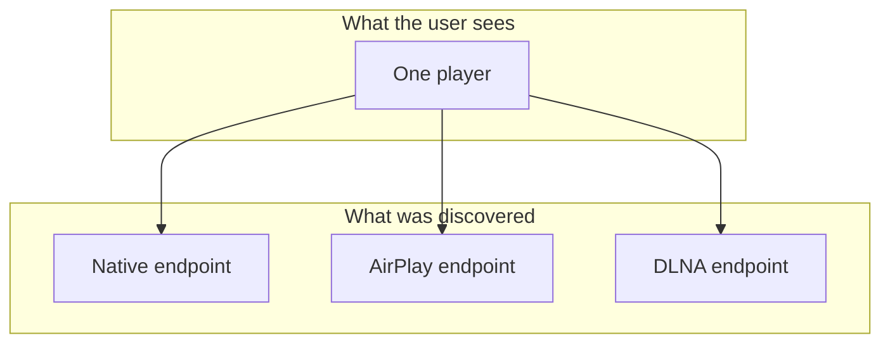

# Protocol linking

One physical speaker often speaks several protocols. A Sonos speaker is discoverable over its own
protocol and over AirPlay. An AV receiver answers to AirPlay and DLNA. Without intervention the
user would see the same box three times in their player list and have to guess which entry to use.

Protocol linking merges those endpoints into one player the user sees, keeping the others as
selectable output paths beneath it.

## Deciding two endpoints are one device

Matching walks a strict reliability hierarchy and takes the first identifier that answers: MAC
address, then serial number, then UUID, then protocol-specific stable ids. Invalid values are
skipped rather than compared.

MAC comparison normalizes away the locally administered bit, because some protocols advertise a
modified MAC that would otherwise never match the hardware one.

**IP address is a last resort with conservative rules.** When both sides have a reliable MAC, IP is
not used at all unless one side is a protocol or wrapper player. Two software players on one host
share an IP while being genuinely different players, and a false merge there is much worse than a
missed one.

**Players from the same protocol domain are never matched**, even with identical identifiers. Two
instances of the same software client on one host are separate players, not one device seen twice.

## Three ways a link forms

A protocol endpoint can attach to a player with native vendor support, where the native player
stays the one the user sees. Where there is no native support, a wrapper player is created to
stand in front of the protocol endpoints. And a bridged transport attaches by declaration rather
than by matching.

## Derived transports

Identifier matching answers whether two endpoints are the same device. It cannot answer whether an
endpoint is a *second, bridged path* through an endpoint already known, and that is exactly what a
bridge is.

A bridge exposes a player of another protocol as a client of the native synchronized protocol, so
a device that speaks only AirPlay can still take part in synchronized playback. The bridge is not
an independent route to the hardware: it **runs inside** the session it rides on, and can only
exist while that base player exists and is enabled.

Bridged players therefore declare which player they ride on, and that single field replaces
identifier matching for them, which is both more accurate and cheaper. On the parent side the
resulting output entry records what it was derived from, which is what distinguishes a bridged
transport from a natively discovered protocol in the API and UI. Without it a bridge would look
like an independent third path to the device.

Bridge existence is reconciled in one place, idempotently, converging on a desired state:
a bridge exists if and only if provider policy wants one and the lifecycle allows it. Disabling the
base player tears the bridge down; re-enabling rebuilds it.

Two subtleties worth knowing. A bridge client can be disabled independently of its base player, and
that is respected. And a bridge client whose disabled state outlived the parent it was disabled
under is healed back to enabled, because bridge ids outlive parent ids and the user would otherwise
be left with no toggle to undo it.

A bridge can also be **claimed** rather than created, which lets a provider adopt an external
client that connected on its own before the bridge could register it.

## Wrapper players

Where no native vendor support exists, a wrapper player is the one the user sees. It starts with no
capabilities of its own and derives everything from its linked protocols.

Its availability gates on whether any linked protocol is actually usable, meaning reachable **and**
not awaiting setup. A wrapper whose only protocol is an unpaired receiver is therefore unavailable
rather than silently broken.

**It forwards the reason, not just the fact.** An unavailable wrapper reports that setup is needed
and why, taken from the child reporting it, so the UI can say "pairing required" on the player the
user can actually see rather than on a hidden child. Running setup on the wrapper delegates to the
child's own flow.

### Passing through an external source

A protocol endpoint can be playing something this server did not start. When no output protocol is
active and such a child reports an external source while not idle, the wrapper mirrors that child
wholesale, and transport commands are forwarded to it.

Its capabilities are narrowed during passthrough to the transport subset. Volume and mute are
deliberately excluded, because the base player already resolves those through the control chain.

Only protocols with reliable metadata participate, and where two qualify the more reliable one
wins.

### Restoring wrappers

Wrappers are persisted and restored on restart, including disabled and unavailable ones. Restoration
reconciles the stored member list against the parent links persisted on the protocol players
themselves, which are the canonical side of the relation. That picks up children pointing at a
wrapper that are missing from its list, which is what an interrupted shutdown leaves behind, and
drops members that moved away or changed type.

A wrapper with no remaining members is not restored, but **its config is deliberately kept**. It
holds user customizations, and wrapper ids are derived from the device, so it is picked up again
when the protocols return.

Wrapper ids derive from a normalized MAC, then a UUID, then the first protocol player. IP is never
used, because DHCP would change it.

Display names are picked from the protocol most likely to have a user-friendly one, rejecting names
that look like MAC addresses, UUIDs or id prefixes.

## Choosing an output

When media plays, one linked protocol is selected as the output, or native playback is used. A
user preference wins where it is satisfiable; otherwise protocols are ordered by a priority that
reflects general audio quality and reliability.

A derived transport is ordered like any other protocol, and sits below the protocols it can ride
on, so a bridge is normally chosen only when the base protocol is unsuitable or the user prefers
it.

The selected output is also what group commands have to be translated onto; see
[Grouping and volume](grouping-and-volume.md).

## Consequences worth knowing

A player streaming through a bridge may report the **bridged** protocol as its active source rather
than the server. Code that treats an unexpected active source as an external takeover has to
account for that, and the group and controller paths do so explicitly.

## Related

- [Players](players.md) for the player model these resolve into.
- [Grouping and volume](grouping-and-volume.md) for translating group commands onto protocols.
- [Discovery](discovery.md) for how the endpoints are found in the first place.
- [providers/universal_player](../../music_assistant/providers/universal_player/README.md) for the
  wrapper provider.
