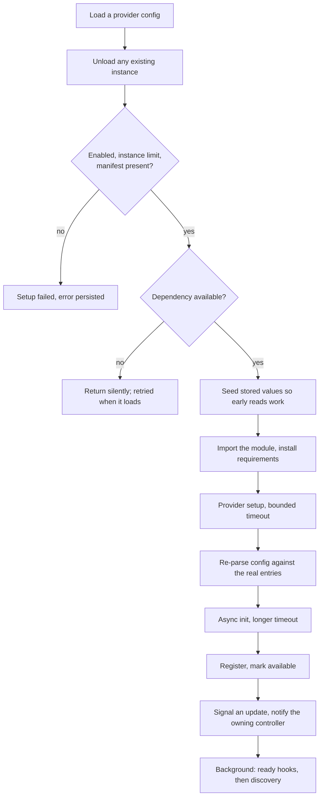

# Providers

Everything external is a provider: a music service, a speaker protocol, a metadata source, an
audio analyzer, or a plugin that does something else entirely. Providers are the only extension
point, and they all load, fail and unload the same way.

## Types

| Type | Is | Base class in |
|---|---|---|
| Music | A source of media: catalogs, libraries, streams | `models/music_provider.py` |
| Player | Speakers and renderers | `models/player_provider.py` |
| Metadata | Art, lyrics and biographies for library items | `models/metadata_provider.py` |
| Audio analysis | Consumes PCM during playback to produce analysis | `models/audio_analysis_provider.py` |
| Plugin | Everything else: live sources, scrobblers, integrations | `models/plugin.py` |
| Core | Core controller manifests, never loaded as providers | not applicable |

The core type needs a careful distinction. Core controllers **do** appear in the settings UI as
first-class entities, each building a manifest so the frontend can render their settings page with
the same components it uses for a provider. But they are never loaded as providers, have no
manifest file on disk, and never enter the provider registry.

## Manifests

Every provider has a manifest file in its directory declaring its type, its domain, whether
several instances are allowed, its Python requirements, its discovery subscriptions, its
dependency on another provider, and its maturity stage.

Manifests are scanned at startup for **all** known providers, not only the configured ones, which
is why discovery subscriptions and the provider list are available before anything loads.
Directories prefixed with an underscore are skipped unless dev mode is on, which is what hides the
annotated demo providers from a normal install.

## Loading

Two ordering details matter to a provider author.

**Entries only exist once the instance does**, because a provider declares them from an instance
method. So stored raw values are seeded as passthrough entries before construction, and the config
is re-parsed against the full entry set afterwards. That is why reading a config value in setup
works.

**The post-load hooks run as a background task**, which is what lets loading announce itself and
return without waiting for device discovery. Internally those steps are still awaited in order.

Load failures are non-fatal. The error is persisted, a status is derived from it, and
`MusicAssistantError` subclasses are retried on a backoff.

## Dependencies are soft

A provider can declare that it depends on another. If the dependency is not available, the load
returns silently with no error and no retry timer of its own, which covers both "not loaded yet"
and "loaded but currently unavailable".

Recovery is driven from the other side: a successful load walks the enabled configs and re-triggers
anything depending on the just-loaded domain. Unloading recursively unloads dependents.

This is eventually consistent when the dependency recovers, but a dependent that hit the silent
gate has no timer, so it waits for that walk rather than polling.

## Unloading

Teardown is ordered to avoid using state it has already destroyed.

It first **waits**, with a timeout, for a running library sync to unwind, rather than
fire-and-forget cancelling it, because later steps tear down state the sync may still be using,
such as a network share mount. It then marks the provider as unloading, because every subsequent
step has an await point and a callback still in flight could otherwise register a player back onto
a provider that is already gone.

Then the relevant controllers are notified, dependents are unloaded recursively, and for a player
provider **every** player is unregistered by reading the registry directly rather than the
provider's own listing, which hides disabled and still-initializing players that nonetheless need
their teardown to run.

The provider's own cleanup runs next, and the final bookkeeping runs unconditionally, so a provider
that raises on unload still leaves the server consistent rather than half-unloaded.

A flag distinguishes a temporary unload, for a reload or restart, from permanent removal, which is
how a player provider decides whether to delete player state for good.

## Failures are structured, not strings

A failed load persists a structured error carrying a code, a message and a translation key with its
arguments and owner. The UI has to tell the user what kind of problem it was, because
"re-authenticate" and "this crashed" call for completely different affordances.

Status is derived on the API read path rather than stored: disabled, loaded, or derived from the
persisted error code, which distinguishes an authentication problem from an incompatible system
from a generic failure.

An incompatible system is never retried, and the frontend offers removal instead.

## Features

A provider declares its capabilities as a set of feature flags, and those flags drive conditional
behaviour everywhere: which library sync options appear, which providers a search queries, which
commands route to a player.

Because the enum is shared with the frontend, a member can exist before the server reads it. Do not
assume every flag is wired up.

One nuance worth knowing: what a provider can **serve** is a separate question from what it can
**list**. A provider that can search and stream a media type it cannot enumerate declares that
separately, which makes it eligible for search-based lookups such as cross-provider matching.
Gating those on library support would have excluded exactly the providers most useful for filling a
gap.

## Retiring a provider

Deleting a provider from the tree makes it silently disappear from an install that was using it,
leaving a config with nothing to explain what happened.

The alternative is a tombstone: the manifest and strings stay, the implementation does not, and the
manifest is marked deprecated so no new instance can be set up. Its setup raises an incompatible
system error, which is never retried and which the frontend renders with a removal button, so the
user gets an explanation plus a one-click resolution.

Existing configs are handled separately, because most installs never actually used it. A one-shot
cleanup looks for evidence of real use and either removes the config entirely or keeps it and lets
the tombstone explain itself. A cleanup that fails deletes nothing and retries on the next boot.

## Core controllers share the contract

Core controllers are not providers, but they share much of the same machinery: the same config and
entry model, the same translation namespacing, the same diagnostics hook.

Their base class is a plain class rather than an abstract one, with a working default for every
hook, so a controller overrides only what it needs.

## Related

- [overview.md](overview.md) for where loading sits in startup.
- [configuration.md](configuration.md) for config entries, setup data and setup flows.
- [discovery.md](discovery.md) for manifest-declared discovery.
- [plugins.md](plugins.md) for what a plugin provider can do.
- [media-library.md](media-library.md) for the music provider contract.
