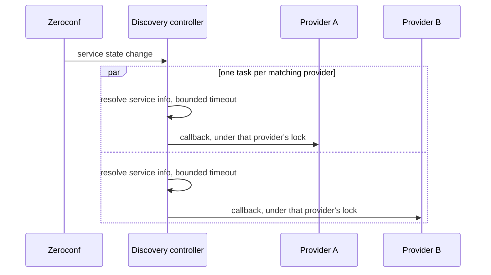

# mDNS discovery

Part of the [discovery controller](README.md).

## One browser for everything

A single service browser covers the union of all service types from all registered manifests,
rather than one browser per provider. Manifests are registered at startup for every known provider,
not only the loaded ones, so the browser's type list does not change as instances come and go.

When a service is found, updated or removed, the event is routed to every loaded, available
provider whose manifest declares that service type, each dispatched as its own task.

A removal passes no service info. An add or update resolves the service **before** taking the
provider lock and holds the lock only around the callback, so concurrent resolves for one provider
can overlap while its callbacks stay serialized.

## Replay for late loaders

A provider loading after startup may have missed announcements that arrived before it was ready.
Replay reads Zeroconf's own cache, filters it to the provider's declared service types, re-resolves
each entry and delivers them as synthetic add events.

The whole replay is serialized under the provider's lock, so it cannot interleave with live events.

Replay deliberately uses a looser match than the on-demand lookup below: it wants every cached
entry for the provider's service types, and there is no single device to match exactly against.

## On-demand lookup

Providers can also pull a specific service synchronously when they need it. The lookup registers a
waiter, clears it, then scans the cache; on a miss it waits, and every incoming mDNS event wakes
every waiter to re-scan until the deadline expires.

Clearing the waiter **before** the cache scan rather than after is what makes this race-free. An
announcement arriving mid-scan still leaves the waiter set, so the next wait returns immediately
instead of blocking until the timeout.

### Name matching is exact

Matching on "does the cache key contain the name filter" is tempting and wrong. A lookup for a
device called `Foo` would also match a different device called `ATV Foo`, and the provider would
build a player out of another device's records.

The rule is: the cache key must contain the service type and must not be the bare service type,
which is the pointer record rather than a device; take the first DNS label; strip a leading RAOP
MAC prefix if present, since RAOP names carry one; then require the remainder to equal the name
filter. Comparison is lowercase throughout, because Zeroconf cache keys are lowercased DNS names.

The MAC prefix pattern is anchored to exactly twelve hex characters followed by the separator, and
substitutes at most once, so a device whose name legitimately contains that separator is not
truncated.

This whole mechanism exists because of a race between the two services an AirPlay device
advertises. They arrive independently and either can be first, but the provider needs both to build
one player, so on receiving one it pulls the other on demand rather than holding partial state and
hoping for a second callback.

## Notes on specific subscriptions

Two manifests are worth knowing about before you change them.

AirPlay subscribes to four service types rather than two. Beyond the pair used to build the player,
the companion and remote records are what make native transport controls on Apple TVs work.

MusicCast subscribes to a generic HTTP service type that is extremely common on a home network, so
that provider filters in its own callback rather than trusting the service type to be meaningful.

One provider owns an entire vendor space and then picks a backend per device, because OEM hardware
advertises the same manufacturer as the vendor's own products and only the model can tell them
apart.

mDNS subscription is a capability of any provider, not only player providers. At least one plugin
provider uses it.
