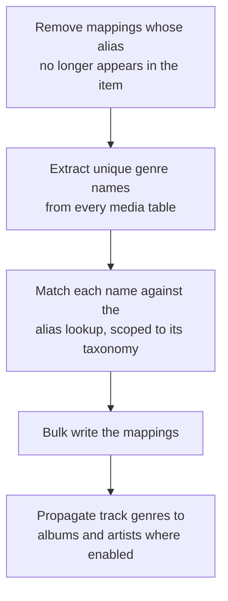

# Genres and metadata

Part of the [metadata controller](README.md).

Genres are owned by the genre sub-controller in
[controllers/music/media](../music/media/README.md), because they are library entities like any
other media type. What belongs here is where genres and metadata meet: enrichment merges
provider-supplied genre strings, and a config option decides whether those may override local ones.

## Aliases

Each genre carries a list of aliases, so one canonical genre covers many upstream spellings. Raw
provider genre strings are normalized the same way the stored names are and matched against those
aliases, which is what collapses the long tail of provider genre vocabulary onto a usable set.

## Three taxonomies

Genres are namespaced by content type, so a podcast "Comedy" never merges into the music "Comedy".

| Taxonomy | Covers |
|---|---|
| Music and general | Everything not spoken-word |
| Podcast | Podcasts and episodes |
| Audiobook | Audiobooks |

Each taxonomy has its own default mapping file and its own icon directory. Stored icon paths are
install-location independent and resolved against the resources directory at serve time, because
absolute paths broke once when a runtime upgrade relocated the site-packages directory. A migration
rewrote them.

## The scanning pipeline

A scan is triggered by library sync completion, by an explicit API call, or by the genre mapping
task. That task runs at a fixed local time and so does not share the randomized schedule the
metadata controller's own daily tasks use.

The propagation step applies to filesystem providers that opt in, and the mappings it creates are
marked as derived. That marking is what later lets propagated genres survive a metadata refresh
when the user prefers local genres.

## Exclusions

A genre can be hidden without being deleted, and listings filter excluded rows out. Separately, a
user can exclude a specific genre from a specific item, which overrides a derived mapping without
affecting the genre itself.
