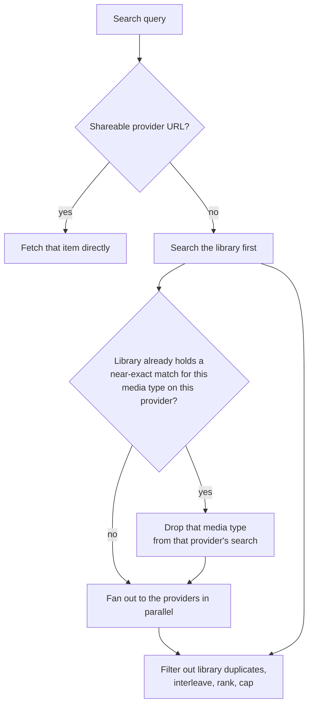

# Music controller

Aggregates and normalizes media items from every music provider into the SQLite library database,
and is the central entry point for library access: search, browse, recommendations, library edits
and playback bookkeeping.

## Package layout

- `controller.py`: the `MusicController`, a core controller holding the orchestration logic and
  composing the per-media-type sub-controllers.
- `database.py`: `MusicDatabaseSetupMixin`, mixed into the controller. Owns the library database
  lifecycle: connection setup, schema creation, maintenance. Kept separate because the schema code
  is large and self-contained, and it carries no state of its own.
- `migrations.py`: the versioned schema migration steps, kept out of `database.py` as an injected
  function so this large block stays self-contained and individually testable.
- `media/`: the per-media-type sub-controllers. See [media/README.md](media/README.md).
- `recommendations/`: the recommendations sub-controller, which aggregates the rows offered by
  every provider that declares the feature. It owns no rows itself.
- `recency.py`: the shared recency engine, which reads the playlog once and answers "was this heard
  recently" in bulk.
- `constants.py`: config keys, the database schema version, background task ids and tuning values.
- `helpers.py`: stateless helpers used by the controller.
- `strings.json`: translatable strings for this module.

## Design notes

**Layering.** The controller orchestrates and the sub-controllers hold the type-specific logic. The
dependency direction is one way, which is what keeps import cycles out.

**Library data model.** Library items use the provider id `library`, and provider mappings record
which provider items a library item resolves to. Maintenance prunes orphaned mappings and playlog
rows. A library item never has a mapping to itself.

**Startup order.** The database is initialized first through the mixin, then maintenance tasks are
registered and provider syncs are scheduled. Setup also finishes any provider removal that a
restart interrupted, so a cleanup resumes rather than leaving half-stripped rows.

## Search

Search is built so that a slow or rate-limited provider cannot stall the whole query, and so that
repeated searches are served from layered caches.

The library is always searched first. Its results are part of the answer, they build the
deduplication set, and they can preempt provider searches entirely when the library already holds a
near-exact match with a mapping to that provider. That shortcut only applies to an unrestricted
global search; an explicit provider selection always searches what was asked for.

Provider searches are never awaited directly. Each one runs as a task keyed on the provider and the
query, so identical concurrent searches share one provider call, and the request waits on it under
a soft timeout. When the soft timeout expires the provider contributes nothing to this response but
its search keeps running, so the result lands in the cache for the next request. A separate hard
timeout bounds the background work for badly rate-limited providers. The combined result is only
cached when every provider contributed, so a failed provider is retried on the next search instead
of having its absence cached.

Results are interleaved one per source per pass and then ranked, lifting literal name matches and
library items to the front.

**Library search uses a trigram FTS index** per media item table. Terms of three characters or more
go through the index; shorter terms fall back to a scan, because a trigram tokenizer cannot match
them at all. Search terms are normalized the same way the indexed column is. Genre and playlist
searches that come back empty get one more attempt through the reverse translation lookup, so an
item is findable by the localized name the user actually sees.

Plugin providers that declare the search feature join the fan-out, and plugin providers that
declare the audio source feature appear in browse. A plugin with exactly one initiable source is
promoted to that source directly, so it is playable in one tap instead of behind a folder holding a
single entry.

## URIs

Every media item has a canonical URI of `provider://media_type/item_id`. The parser in
[helpers/uri.py](../../helpers/uri.py)
also accepts the public share URLs of the major streaming services, colon-separated ids, generic
stream URLs and local file paths, the last two resolving to the builtin provider with an unknown
media type. Ids can optionally be validated per provider, which is what lets search tell a
malformed share link apart from something that was never a URI.

Audio sources and sound effects are deliberately not library-backed. Their existence depends on a
loaded provider and they have no stable identity, so adding them to the library or to favorites is
rejected up front.

## Provider orchestration

Fetching an item checks the library for a row matching that provider and item id, and returns the
library item when there is one, optionally scheduling a background metadata refresh. Otherwise it
resolves the provider instance and asks it directly.

For an item available from several providers the library stores one canonical row plus one mapping
per provider. Non-unique streaming mappings are cloned across all instances of the same domain, so
a second account on the same service inherits the first one's mappings. Cloned mappings are marked
so they can be told apart from mappings the item was genuinely added on, which both album track
import and sync deletion rely on. A recurring task re-runs the cloning over the whole library so
mappings created before a second instance existed catch up.

One instance per streaming domain is queried for search and lookups, while every instance of a
non-streaming provider is queried, because a streaming provider's catalog is far larger than the
user's library and a local provider's catalog is its library. This is also where the current user's
provider filter is applied, so most call sites are user-scoped by construction.

## Library sync

Sync keeps the local database in step with each provider's catalog. Loading a provider registers a
recurring task per supported media type, each gated on that provider's sync toggle for the type,
and unloading unregisters them. The interval is per provider, defaulting to twice a day. An
on-demand sync runs the same tasks at higher priority and records the requesting user.

A global lock serializes all provider syncs, so only one provider and media type combination runs
at a time. That avoids database contention and duplicate matching.

Two bulk-write behaviours matter here. Each per-item block commits once rather than per statement,
and the whole run suppresses per-item events. Change detection avoids hydrating objects at all: a
lightweight snapshot of ids, flags and raw mappings is enough to decide whether a write is needed.

Deletion handling compares this run's ids against the previous run's. For a non-streaming provider
with no other in-library mappings left, the item is genuinely gone and is removed, because dangling
rows stay visible in artist and album views that do not filter on library membership. Otherwise the
mapping is kept and flagged as no longer in the provider's library, which preserves accumulated
metadata, and the item loses its favorite flag once no provider has it any more.

## Database schema

The schema version lives in `constants.py`. Tables, indexes and triggers are created in
`database.py`; the version-by-version upgrade steps live in `migrations.py`.

| Group | Tables |
|---|---|
| Media items | One per media type, each with a companion FTS index over its normalized search column |
| Relationships | Album tracks, track artists, album artists, audiobook artists, genre mappings and genre exclusions |
| Provider linkage | Provider mappings, external id lookup |
| Analysis and history | Audio analysis, analysis failures, playlog |
| Bookkeeping | Settings, holding the stored schema version |

The FTS indexes are external-content tables, so they store no second copy of the data, and triggers
keep them in step. The migration tail rebuilds every index, so it is correct both on first upgrade
and after a step that rewrote rows while triggers were inactive.

Provider mappings are the central join between canonical library items and their sources. Each
entity query aggregates an item's mappings and external ids back into the JSON shapes the models
expect, so consumers see no difference.

The playlog is per user rather than global, and it has grown from a play history into the record
that recommendations, resume, scrobbling and recency all read. It stores the artists as they were at
play time, so recency can match the same song across releases without a provider lookup. Nightly
cleanup prunes old entries.

### Migrations

Anything older than schema 15 is refused outright. The database file is copied to a backup before
migrating. If a migration raises, the file is deleted and recreated empty, the cache is cleared and
a full rescan is triggered, so the user always ends up with a working library and the backup is
left in place. A fresh install seeds the default genres. Startup finishes with a vacuum, skipped
unless enough of the file is reclaimable to be worth it.

A failed library migration costs the user a full rescan, so a step has to be idempotent, survive
missing and half-written values, and never raise.

## Schema versions on dev versus stable

The schema version is a single integer, so it can only describe one linear history. `stable`
normally inherits dev's numbering through releases, but a schema-changing bugfix backported to
`stable` is renumbered against stable's own lower counter, and from that point the same integer
means something different on each branch.

A database coming from `stable` then reports a version already higher than the gates of the dev
steps in the gap, so those steps never run and the schema objects they add stay missing. Table
creation cannot compensate, because it only creates tables that do not exist and never touches an
existing one. The user-visible result is a library that queries columns the database never got,
which has already happened once when a stable install was moved to the beta image.

Renumbering the stable backport to match dev does not fix it either: the database would then claim
to have run every dev step in between, which it genuinely never did. Encoding that correctly needs
a per-step applied-migrations ledger, which is out of proportion to how rarely this triggers. So
when backporting a schema change to `stable`:

1. Record in the backport PR that stable's schema version now diverges from dev's, and which value
   it took.
2. On `dev`, bump the schema version and add an idempotent guard step re-adding every schema object
   introduced between the last shared version and stable's new one.
3. Gate that guard at dev's current version, never at stable's. Migration is skipped entirely when
   the stored version already equals the current one, so users who upgraded and broke are stamped
   at the current version and a lower gate never fires for them.

## Recommendations

`recommendations/` owns the API and produces no rows. It gathers rows from every provider that
declares the feature, which can be a music, metadata or plugin provider, and interleaves them one
folder per source per pass so no single provider monopolizes the top of the page.

Rows and items are separate calls. The listing has to be cheap enough to render a Discover page
immediately, and each row's contents are fetched as it scrolls into view. Row fetches are bounded
by a short timeout because rows are contractually cheap with no live backend calls, and item
fetches by a longer one. A timeout or error yields an empty list, so one misbehaving provider
degrades to a missing row rather than a failed page. The item call re-applies the user's provider
filter and re-checks the feature, so a user cannot reach into a restricted provider by calling it
directly with a row id.

The library rows are no exception to the aggregation, because they are a provider too: a builtin
plugin provider whose only feature is recommendations. The controller has no library-specific branch
left. Moving the rows out means they compose through the ordinary provider machinery, and it lets
them be reordered or extended without touching this controller. Rows that are interesting to some
libraries and noise in others ship disabled by default. Library rows support the provider filter
through the reachable-via listing filter, which is what lets a user restrict "recently added" to a
single service.

Most streaming providers get their recommendations from one bulk backend call, and a mixin factors
that out: the provider implements only the payload fetch and the mixin derives both the rows call
and the per-row items call from it. Caching is stale-while-revalidate in memory and in the cache
database, so a cold instance after a restart warms from cache with at most one read. Concurrent
callers share one shielded fetch, so a timed-out caller cannot cancel it for the others. The mixin
cancels in-flight work on unload, which is why it has to be listed before the provider base class
for that override to be reachable.

## Recency engine

`recency.py` answers "was this heard recently" fast and in bulk, because smart shuffle, dynamic
playlist deduplication and dynamic radio refills would otherwise issue one playlog query per
candidate track. One batched user-scoped query returns an immutable snapshot. Lookback windows are
configurable per dimension, a disabled window drops that dimension, and if all are disabled the
query is skipped.

The snapshot indexes plays three ways, which is what makes cross-provider matching work. Exact
identity is checked against the track's own provider and item id and against every one of its
provider mappings, so the same track played from another account still counts. A fuzzy key of
normalized title and artist catches a remaster, a single versus album edit, or differing artist
credits across providers. Artist recency is keyed on the name, because artist playlog rows are
keyed by library id and the name is the only portable key. Rows written before the artists column
existed contribute no fuzzy key and regain one on the next play.

## Dynamic playlists are library rows

A dynamic playlist is not a separate concept here. It is an ordinary playlist row with the dynamic
flag set. Two plugin providers write them: one rule-based, where the flag decides whether tracks
are re-evaluated on every play or frozen once, and one that renders a seed as a playlist. Everything
downstream treats them like any other playlist. Only the queue controller reads the flag, to decide
whether to run a bounded managed pool instead of a linear enqueue.

## User-scoped access

The library is read through a per-user lens. A non-admin user can be restricted to a subset of
music provider instances, and that filter applies to the provider lists, to browse, to
recommendations and to every library listing. It also steers which mapping an item's details are
fetched from. Plugin providers are never restricted. Play history, resume positions and recency are
scoped by user. An explicit provider request is intersected with the user's allowed providers, and
an empty intersection raises rather than silently returning nothing.

## Related architecture docs

- [Providers](../../../docs/architecture/providers.md) for the provider interface, features and load lifecycle.
- [Playback](../../../docs/architecture/playback.md) for how library items reach a queue and a speaker.
- [Plugins](../../../docs/architecture/plugins.md) for audio sources, dynamic playlists and plugin-contributed rows.
- [Events and commands](../../../docs/architecture/events-and-commands.md) for the media item events and scopes.
