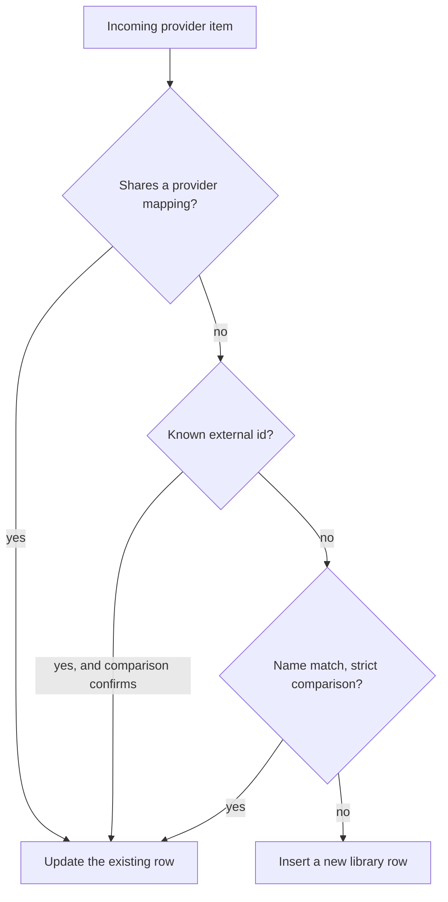

# Media sub-controllers

One sub-controller per media type, all sharing `MediaControllerBase`. The base class is generic
over its item class and owns the library interaction pattern; each subclass adds the type-specific
queries and relations. Subclasses never import `MusicController` back, which keeps the dependency
direction one way.

| Module | Media type |
|---|---|
| `base.py` | `MediaControllerBase`, shared by all of the below |
| `artists.py` | Artists, including audiobook authors and narrators |
| `albums.py` | Albums |
| `tracks.py` | Tracks |
| `playlists.py` | Playlists, including the dynamic ones |
| `radio.py` | Radio stations |
| `audiobooks.py` | Audiobooks |
| `podcasts.py` | Podcasts and their episodes |
| `genres.py` | The genre taxonomy |

## What the base class gives you

The base class registers the per-type API surface in its constructor, so a new media type gets
count, listing, fetch, update and remove commands without declaring them. Most of the public
surface is final. Subclasses customize through the two query properties, the row parse hooks, and
their own add and update implementations, rather than by overriding public methods.

A subclass must implement three things: adding a library item, updating a library item, and
matching the item against other providers.

Every listing funnels through one query builder that composes the filters, the fast random path,
collection collapsing and the final select. Two choices there are worth knowing about before you
change them. Provider and in-library filters are correlated subqueries rather than a join with a
group-by, and the group-by is only added when a caller supplied joins that can fan rows out. Both
exist so SQLite can stream from a sort index instead of materializing and sorting the whole result.

### Summary mode

List endpoints return summary items by default. A summary selects only what a list view needs and
builds a slim item class rather than hydrating a full media item. Internal callers that need
metadata, artists or album relations opt back into the full object.

The summary query deliberately selects the normalized search and statistics columns even though a
list view does not display them, because the sort keys order on them and they have to be resolvable
from the result set. Availability is recomputed from the provider mappings, because a summary item
cannot inherit the full item's availability logic.

### Reachable via

Restricting a listing to items with an available mapping to given provider instances answers a
different question from "is this in my library". A library assembled from several services still
lists items a particular service cannot play, which is wrong for a row scoped to one provider and
wrong for a user an admin restricted to a subset. An explicit empty list means "restrict to no
providers" and returns nothing; no list at all means "do not restrict". Callers have to respect
that difference. Counts apply the user's provider filter the same way, so a count never disagrees
with the list it labels.

### Collections

Collapsing collections groups library items that share a collection name, so an audiobook series
appears once instead of as every book in it. The composed query is wrapped in a CTE that aggregates
rows per collection name, and sorting is restricted to the subset of sort keys that survive the
aggregation. Collection item ids encode the media type and the collection name, which is how a
fetch routes back to the owning sub-controller. Audiobooks are currently the only type wired up.

## Match and store

Adding an item to the library is a match-first operation, and the whole insert runs inside one
deferred commit so the entity row, provider mappings, external ids, junction rows and genre
mappings land in a single commit.

A per-type lock serializes inserts so concurrent syncs cannot race. The deferred commit is a
batching mechanism and not a transaction: it always commits on exit, including on error, because
the connection is shared and rolling back would discard other tasks' acknowledged writes.

Adding a mapping that already belongs to a different library item merges the two. That implicit
merge is also available explicitly, and both paths go through the same code so there is one audited
way for two library items to become one. The explicit target is the deterministic winner: its
values stay authoritative wherever the normal non-overwrite update model would keep them, and the
source is applied as if it were an incoming update.

### External ids

External id matching goes through a dedicated indexed table rather than a JSON column, because a
JSON column needs a scan no index can serve. An empty set of ids is a no-op and never clears the
stored ids. This mirrors the provider mapping policy: a sync that happens to return nothing must
not strip an item of the identity evidence everything else matches on.

An indexed lookup only works if both sides agree on spelling, and providers do not. The same
barcode arrives as a UPC, an EAN or a GTIN, ISRCs turn up hyphenated, and MusicBrainz ids come
wrapped in braces. [helpers/external_ids.py](../../../helpers/external_ids.py)
centralizes that normalization so the write path and the read path cannot drift apart. It also
completes a barcode that is missing its check digit, because at least one provider omits it.

External ids are addressable from the API, and that path tries the library first before asking
providers. Provider support is opt-in per media type, so a provider can implement track lookup by
ISRC without claiming album or artist lookup.

### Event suppression during bulk work

A context variable suppresses the per-item added and updated events. A full library sync would
otherwise emit one event per touched item, serialized once per connected client. While suppressed,
an update also skips writing the change back to the provider, because during a sync the update came
from that provider. Two callers set it: the provider sync handler and provider cleanup. Deletions
are never suppressed. Clients follow progress through task events and refresh once when the sync
completes.

## Comparison

[helpers/compare.py](../../../helpers/compare.py)
holds three related comparison APIs. One is boolean and answers "are these the same item". Two are
graded and answer "how confident are we, and would more data help". That distinction matters
because the boolean form has to guess when metadata is thin, while a caller that can fetch a
tracklist would rather be told the question is still open.

**Boolean comparison** dispatches by type. For tracks it checks provider identity, then primary
external ids which are definitive in both directions, then secondary external ids where only a
positive match counts, then a sequence of text filters that can each reject early, and finally
duration within tolerance.

**Album evidence is tri-state.** Albums are the hard case, because two providers' copies of the
same record routinely differ only by an edition or a retail suffix, and the album's own fields
cannot settle it. Alongside match and no-match there is an explicit "insufficient", and that is the
whole point of the API. The albums sub-controller escalates rather than guessing: it fetches
ordered tracklists for both sides and re-runs the comparison with them, so a fingerprint resolves
the ambiguity, and a conflicting fingerprint overrides an otherwise nominally matching album. Only
then does it fall back to MusicBrainz. A mapping is accepted on a match and nothing weaker. The
candidate tracklist is fetched from the exact provider instance the album was matched on, so a
same-domain fallback can never fingerprint against a different account or server.

**Track confidence is graded** for the separate problem of finding a track on another provider,
where the caller decides how good a substitute is acceptable. Release-level evidence outranks
recording-level evidence, which outranks metadata agreement alone, and conflicting authoritative
ids rank as no match. Playlist migration is the consumer: user intent maps onto a confidence floor,
and the migration report labels each track with the confidence it matched at.

## Type-specific notes

**Artists** carry a type that distinguishes singers from audiobook authors and narrators, so an
artist listing does not mix them. Removing an artist cascades to albums and tracks that have no
other artist references.

**Audiobooks** treat authors and narrators as first-class artists, while keeping the plain string
columns for providers that only supply names. Reads prefer the linked artists and fall back to the
strings, and the sync snapshot records which shape is stored so a sync can tell when an upgrade is
needed. Search runs the normal indexed pass first and appends an author and narrator scan when the
first page came back thin.

**Radio stations** can be dynamic, meaning the provider generates the content on demand rather than
pointing at a fixed stream. Being dynamic disables name-based linking in both directions. Two
providers offering a station called "Chill" are offering the same broadcast when it is a real
stream, and two entirely different generators when it is dynamic, so the ordinary cross-provider
merge would produce a station that plays the wrong thing.

**Playlists** record which media types they can hold, so adding an unsupported type is rejected. A
provider-supplied name can carry a translation key and parameters so it survives the library round
trip localized, and updates adopt a synced item's key and parameters as a unit rather than mixing
an old key with new parameters. Migration copies a playlist onto another provider or into managed
storage, matching each track through the graded comparison and reporting what was approximated.

**Genres** are the only editable taxonomy here, and the largest sub-controller. Spoken-word
taxonomies are namespaced separately from music, so a podcast "Comedy" never merges into the music
"Comedy". Aliases let many provider genre strings resolve onto one canonical genre. Exclusions hide
a genre without deleting it, with per-item overrides for derived mappings. A scheduled scan
re-derives mappings across the library, using a short-lived name lookup so a running sync picks up
user edits without re-querying per item.

## Related architecture docs

- [Providers](../../../../docs/architecture/providers.md) for the provider interface these controllers fetch through.
- [Overview](../../../../docs/architecture/overview.md) for where the music controller sits.
