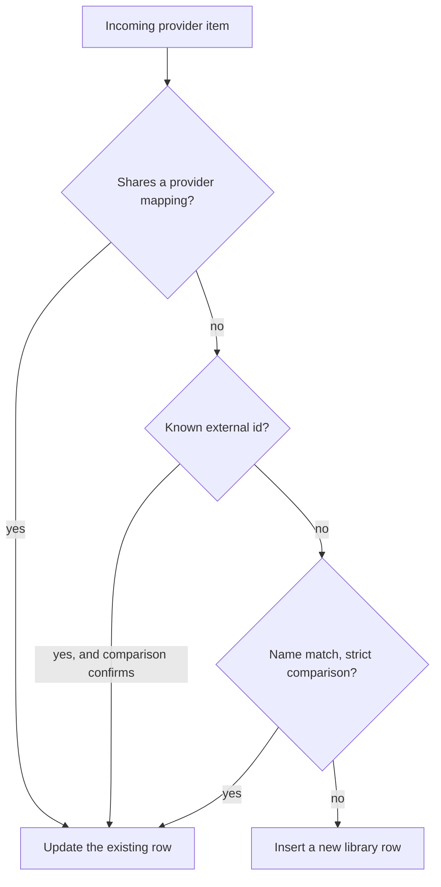

# Matching and merging

Part of the [media sub-controllers](README.md). How an incoming provider item becomes, or joins, a
library row.

## Match and store

Adding an item to the library is a match-first operation, and the whole insert runs inside one
deferred commit so the entity row, provider mappings, external ids, junction rows and genre
mappings land in a single commit.

A per-type lock serializes inserts so concurrent syncs cannot race. The deferred commit is a
batching mechanism and not a transaction: it always commits on exit, including on error, because
the connection is shared and rolling back would discard other tasks' acknowledged writes.

## Merging two library items

Adding a mapping that already belongs to a different library item merges the two. That implicit
merge is also available explicitly, and both paths go through the same code, so there is one
audited way for two library items to become one.

The explicit target is the deterministic winner. Its values stay authoritative wherever the normal
non-overwrite update model would keep them, and the source is applied as if it were an incoming
update, then deleted. Merging an item into itself, or across media types, is rejected.

## External ids

External id matching goes through a dedicated indexed table rather than a JSON column, because a
JSON column needs a scan no index can serve.

An empty set of ids is a no-op and never clears the stored ids. This mirrors the provider mapping
policy: a sync that happens to return nothing must not strip an item of the identity evidence
everything else matches on.

An indexed lookup only works if both sides agree on spelling, and providers do not. The same
barcode arrives as a UPC, an EAN or a GTIN, ISRCs turn up hyphenated, and MusicBrainz ids come
wrapped in braces. [helpers/external_ids.py](../../../helpers/external_ids.py) centralizes that
normalization so the write path and the read path cannot drift apart. It also completes a barcode
missing its check digit, because at least one provider omits it, and it produces every
index-compatible variant a stored value could match so a legacy row written before normalization
is still found.

External ids are addressable from the API, and that path tries the library first before asking
providers. Provider support is opt-in per media type, so a provider can implement track lookup by
ISRC without claiming album or artist lookup.

## Comparison

[helpers/compare.py](../../../helpers/compare.py) holds three related comparison APIs. One is
boolean and answers "are these the same item". Two are graded and answer "how confident are we,
and would more data help". That distinction matters because the boolean form has to guess when
metadata is thin, while a caller that can fetch a tracklist would rather be told the question is
still open.

### Boolean comparison

Dispatches by type. For tracks it checks provider identity, then primary external ids which are
definitive in both directions, then secondary external ids where only a positive match counts,
then a sequence of text filters that can each reject early, and finally duration within tolerance.

### Album evidence is tri-state

Albums are the hard case. Two providers' copies of the same record routinely differ only by an
edition or a retail suffix, and the album's own fields cannot settle it. So alongside match and
no-match there is an explicit "insufficient", and that third state is the whole point of the API.

The albums sub-controller escalates rather than guessing. It fetches ordered tracklists for both
sides and re-runs the comparison with them, so a fingerprint resolves the ambiguity, and a
conflicting fingerprint overrides an otherwise nominally matching album. Only if that is still
inconclusive does it fall back to MusicBrainz. A mapping is accepted on a match and nothing weaker.

The candidate tracklist is fetched from the exact provider instance the album was matched on, so a
same-domain fallback can never fingerprint against a different account or server. An unavailable
tracklist is treated as absent rather than as a mismatch.

Two refinements support this. Retail suffixes such as an EP or single marker are stripped, on both
the Python and the SQL side so the query and the comparison agree. And a shared barcode identifies
the same retail product, which resolves an edition difference outright.

### Track confidence is graded

A separate graded API exists for finding a track on another provider, where the caller decides how
good a substitute is acceptable. Release-level evidence outranks recording-level evidence, which
outranks metadata agreement alone, and a conflicting authoritative id ranks as no match. The best
candidate at or above a floor is returned, and ties can be reported as ambiguous.

Playlist migration is the consumer. User intent maps onto a confidence floor, and the migration
report labels each track with the confidence it was matched at.
