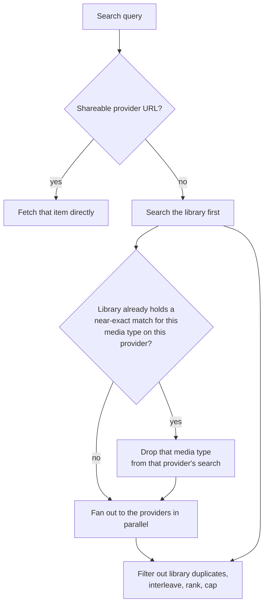

# Search and URIs

Part of the [music controller](README.md).

Search is built so that a slow or rate-limited provider cannot stall the whole query, and so that
repeated searches are served from layered caches.

## The library goes first

Library results are part of the answer, they build the deduplication set, and they can preempt
provider searches entirely when the library already holds a near-exact match with a mapping to
that provider. That shortcut applies only to an unrestricted global search; an explicit provider
selection always searches what was asked for.

## Provider fan-out

Provider searches are never awaited directly. Each runs as a task keyed on the provider and the
query, so identical concurrent searches share one provider call, and the request waits on it under
a soft timeout.

When the soft timeout expires the provider contributes nothing to this response, but its search
keeps running so the result lands in the cache for the next request. A separate hard timeout bounds
that background work for badly rate-limited providers.

The combined result is cached only when every provider contributed. A failed provider is therefore
retried on the next search rather than having its absence cached.

Results are interleaved one per source per pass and then ranked, lifting literal name matches and
library items to the front.

## Library search uses a trigram index

Each media item table has a companion full-text index over its normalized search column. Terms of
three characters or more go through the index; shorter terms fall back to a scan, because a trigram
tokenizer cannot match them at all. Search terms are normalized the same way the indexed column is.

Genre and playlist searches that come back empty get one more attempt through the reverse
translation lookup, so an item is findable by the localized name the user actually sees. See
[controllers/translations](../translations/README.md).

## Plugin providers in search and browse

Plugin providers that declare the search feature join the fan-out, and those that declare the audio
source feature appear in browse. A plugin with exactly one initiable source is promoted to that
source directly, so it is playable in one tap instead of sitting behind a folder holding a single
entry.

## URIs

Every media item has a canonical URI of `provider://media_type/item_id`. The parser in
[helpers/uri.py](../../helpers/uri.py) also accepts the public share URLs of the major streaming
services, colon-separated ids, generic stream URLs, and local file paths. The last two resolve to
the builtin provider with an unknown media type.

Ids can optionally be validated per provider, which is what lets search tell a malformed share link
apart from something that was never a URI at all.

Audio sources and sound effects are deliberately not library-backed. Their existence depends on a
loaded provider and they have no stable identity, so adding them to the library or to favorites is
rejected up front.
