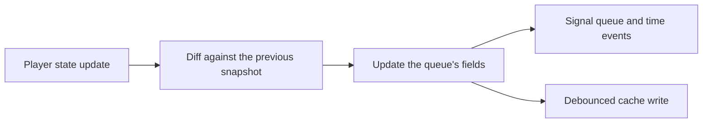

# State, persistence and reconciliation

Part of the [player queues controller](README.md).

## What is held where

All live state is in memory, one record per queue. That record wraps the client-facing snapshot and
adds everything that never leaves the server: the ordered item list, the full media items behind
the dynamic sources, the enqueued parent items, the owning user, the transient stream-session
fields, and runtime bookkeeping such as the previous-state snapshot, the transitioning flag and the
in-progress action count.

## Persistence

Durable state goes to the cache controller under two categories, queue state and queue items, keyed
by queue id. The state entry is a versioned envelope, so an incompatible format is discarded rather
than misread.

Writes are debounced, marked persistent, and issued per category only when that category's content
actually changed. Volatile progress fields such as elapsed time do not count as a change, so
neither category is re-serialized on every state tick.

Restore is deliberately resilient. A queue's settings survive even when some of its media items no
longer deserialize, so a provider that changed its model does not cost the user their queue
settings. On registration both entries are restored, the dynamic-source flag is recomputed, and the
play-action flag is reset in case the server was killed mid-action. Permanent player removal drops
the record and both cache entries.

## Reconciling against the player

The controller consumes player lifecycle and per-update callbacks. From what the player reports it
decides whether the queue is active, derives the current index and item, and recomputes elapsed
time. It diffs the incoming state against the previous snapshot to detect transitions, such as a
track played to completion or the end of the queue, and emits queue and time events.

Flow mode is the special case. Instead of one stream per track the whole queue is a single
continuous stream of concatenated items, so the player's cumulative stream index and position have
to be mapped back to a per-track index and per-track elapsed time.

## Play counting and resume

The controller decides when a track counts as played and reports it to the music controller. Plays
are deduplicated through a last-counted marker, with album-level handling, so a track is not
double-counted on the end-of-queue idle transition.

It also computes and applies resume positions for audiobooks and podcast episodes, and can restore
a previously playing queue from the playlog.
