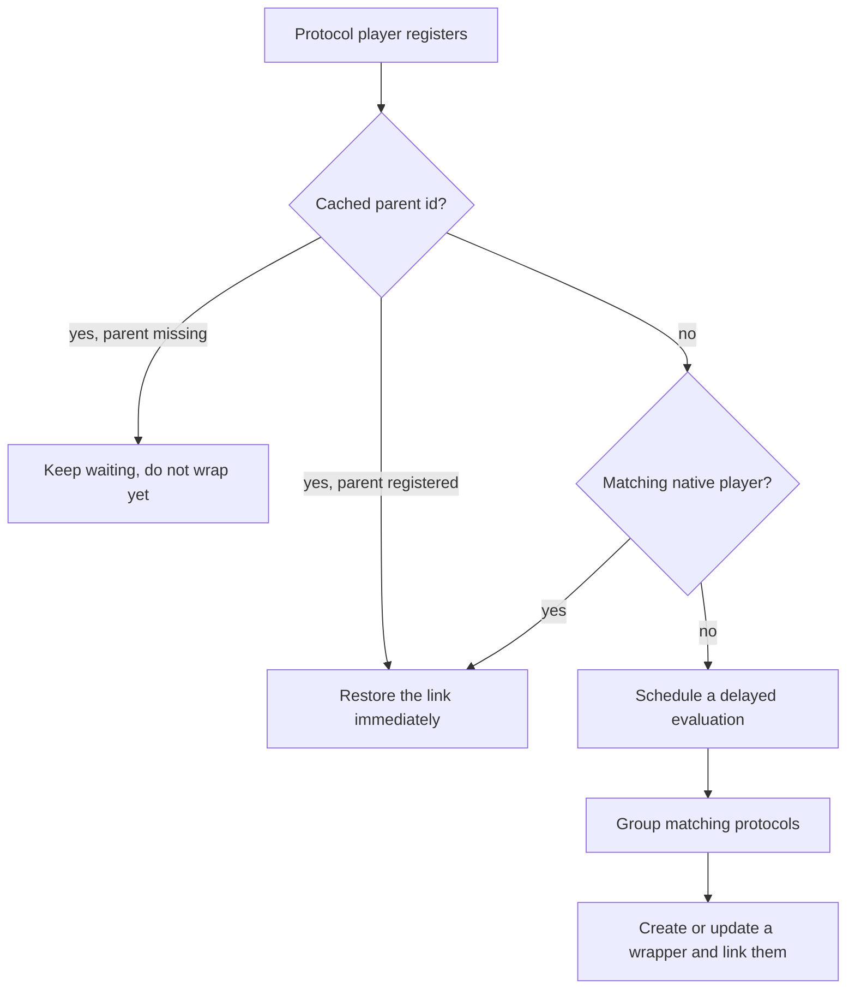

# Protocol linking internals

Part of the [player controller](README.md). The concept and its rationale are in
[the architecture doc](../../../docs/architecture/protocol-linking.md); this covers the mechanics.

## Identifier matching

Protocol players are matched to the same physical device by identifier, in order of reliability:
MAC address, serial number, UUID, protocol-specific stable ids, and finally IP address. Players
without any usable identifier fall back to their own player id as the device key, so they still get
a consistent wrapper.

MAC addresses are validated before use, and comparison normalizes away the locally administered
bit so a protocol-modified MAC still matches the hardware one. Where possible an address lookup
resolves a real MAC.

**IP matching is intentionally conservative.** Strong identifiers are checked first, and IP is used
only when at least one side lacks a reliable hardware identifier, or when a protocol or wrapper
player still needs a last-resort match.

**Players from the same protocol domain are never matched**, even sharing a MAC or IP. That is
deliberate: several software player instances on one host are separate logical players, not one
device seen several times.

## The linking flows

### A native player registers

The controller searches for protocol players with matching identifiers, links them, and the
protocol players become hidden while the native player gains its output protocols.

### Protocol players register with no native match

Each schedules a delayed evaluation, which batches simultaneous discoveries. After the delay,
matching protocols are grouped and a wrapper is created, **even for a single unmatched protocol
player**, so every protocol player ends up with a user-facing entity.

The delay is longer when the player was previously linked to a parent that has not registered yet,
because that parent is probably still starting up and wrapping early would have to be undone.

### A native player appears for a wrapped device

The native player takes over. Active and cached protocol ownership transfers, the wrapper's user
configuration carries across, meaning its custom name, config values, DSP and per-queue settings,
group memberships are re-pointed, and the wrapper is removed.

**A link can be refused**, most commonly when the native player already holds an active link from
the same protocol domain. So the handover compares what actually moved against what was active: if
anything failed to move, **the wrapper is kept** and only the moved protocols are handed over,
rather than leaving the refused ones orphaned. The wrapper is removed only once every active
protocol transferred.

### Derived transports

A protocol player can ride on another output rather than being an independent path to the device.
Those declare which player they ride on, and the controller resolves their parent from that edge
rather than from identifiers.

A derived player attaches to the parent of the player it rides on, or to that player itself when it
is not a protocol player. A second pass runs after any player is linked or registered natively, to
pick up derived players that registered before their underlying player had a parent.

Derived players are skipped by identifier matching and never seed a wrapper of their own.

The parent's output entry records what the transport was derived from, holding either the base
output's id or a marker meaning it rides on the parent directly. Without that, a derived transport
would look like an independent third path to the device.

## Output selection

When media plays, the controller picks an output in this order: a protocol that is already actively
grouped or synced, then the user's configured preference, then native playback where available, and
finally the best remaining protocol by a fixed priority that reflects general reliability and audio
quality.

## Persisted state

Links survive a restart, which is what makes reconnection fast.

| Stored on | Holds |
|---|---|
| The native or wrapper parent | The list of linked protocol player ids |
| A protocol player | Its cached parent id |
| A bridge protocol player | The player it rides on |

## Scenarios worth testing

A single-protocol device should still get a wrapper. A multi-protocol device should end up with one
wrapper holding all of them. A protocol discovered late should join an existing wrapper. A native
player appearing should replace the wrapper and carry its settings over. Permanent removal of a
parent should reset the links and re-schedule discovery. And a protocol disappearing should degrade
gracefully rather than leaving a broken entity.
