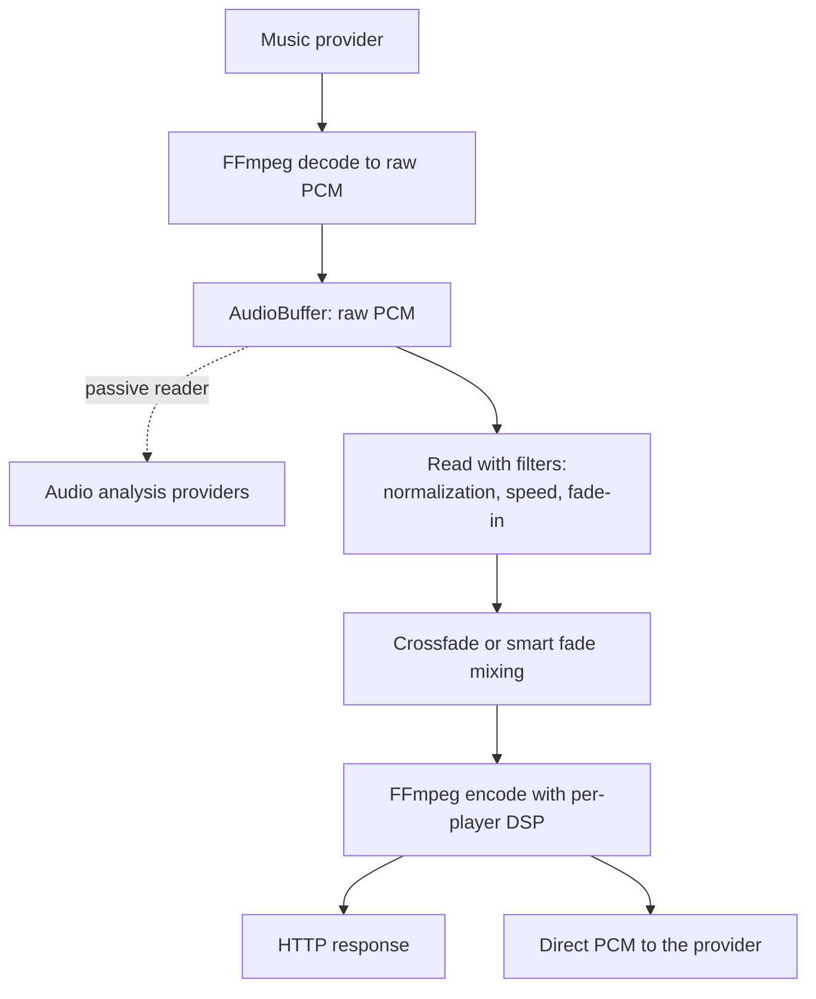

# Streams controller

Owns everything between a resolved media item and audio arriving at a player: decoding, buffering,
normalization, crossfading, DSP, encoding and HTTP delivery. It also hosts the passive audio
analysis readers that sit on the playback buffer.

## Deep dives

- [Buffering and pacing](buffering.md): buffer modes, the buffer lifecycle, and output pacing.
- [Normalization, crossfade and overlay](processing.md): volume normalization, crossfade, and the
  audio overlay.
- [DSP, formats and fidelity](output.md): DSP and output plans, format selection, fidelity and
  bit-perfect.
- [Audio analysis](analysis.md): the passive analysis readers, the providers, the background scan.

## Module layout

| Module | Role |
|---|---|
| `controller.py` | The `StreamsController`: HTTP endpoints and the public streaming API |
| `audio.py` | `StreamsAudio`: stream acquisition, queue and flow streaming, format selection, output plans |
| `audio_buffer.py` | `AudioBuffer`: in-memory PCM buffering with seek support |
| `audio_processing.py` | `AudioProcessingManager`: the per-queue processing chain reported to clients |
| `audio_analysis.py` | `AudioAnalysisController`: distributes buffered PCM to the analysis providers |
| `live_announcements.py` | Announcement audio pushed into the server and served back out |
| `ogg_handler.py` | Chained OGG stitching for radio streams with in-band metadata |
| `smart_fades/` | Crossfade planning, rendering and mixing |
| `constants.py` | Buffer sizes, pacing profiles and config keys |
| `strings.json` | Translatable labels for this module's config entries |

Generic audio utilities that need no controller access live in
[helpers/audio.py](../../helpers/audio.py), and FFmpeg process management lives in
[helpers/ffmpeg.py](../../helpers/ffmpeg.py).

## A separate HTTP server

Streams are served by a dedicated HTTP-only server on its own port, independent of the main
webserver. This is deliberate on three counts. There is no TLS, because many embedded players
struggle with handshakes and the stream server only serves the local network. There is no
authentication, because players cannot hold credentials; instead a stream URL carries a session id
that is validated per request, which is what rejects a stale stream attempt. And the separate port
keeps audio delivery isolated from the API.

### Audio travelling inwards

Live announcements are the one path where audio travels into the stream server rather than out of
it. A client pushes raw PCM while a user speaks and it plays on a player as an ordinary
announcement. The two halves live on different servers because neither can do the job alone. The
inbound half is a WebSocket on the main webserver, because pushing audio is a privileged action
that needs authentication and TLS, and because browsers require a secure context to reach a
microphone at all. The outbound half is an ordinary stream server route serving the buffered speech
as a WAV, because the announcement renderer only ever pulls from a URL, which keeps live
announcements on the same path as every other announcement.

The announcement is dispatched only once the clip is complete. Players that announce natively need
the whole clip up front: AirPlay renders it to a file and schedules one synchronized instant across
every group member from its exact duration, and Sonos needs the duration to know how long the clip
runs. A still-growing clip gives one player type a head start and truncates another, so every
player gets the same finished clip.

## The pipeline

Players that consume HTTP streams are served from the stream server's endpoints. Player providers
that consume raw PCM directly, such as AirPlay and Sendspin, take the stream in process.

Not everything takes the whole path. Live audio sources bypass the buffer, normalization, crossfade
and overlay entirely, because they are realtime and have nothing to buffer ahead of. Sound effects
enter as an extra FFmpeg input rather than as a stream of their own.

## Configuration

Config entries cover the buffer size preset, which defaults by host memory, the normalization
modes and gains for radio and tracks separately, the global target loudness, whether consecutive
album tracks may crossfade, the bind address and port and the IP published to players in stream
URLs, and the concurrency of the nightly analysis scan.

**The published address must be an IP literal, not a hostname.** It is handed on to protocols that
accept only literals, so a hostname does not fail at the setting, it fails later as silence from a
player. The entry validates it, and a stored hostname surviving from an earlier version is reset to
automatic once, with a warning, rather than being resolved.

## Related architecture docs

- [Playback](../../../docs/architecture/playback.md) for the end-to-end flow from a play request to
  audio.
- [Players](../../../docs/architecture/players.md) for how a player declares its supported formats.
- [Grouping and volume](../../../docs/architecture/grouping-and-volume.md) for group streams and
  shared outputs.
- [Plugins](../../../docs/architecture/plugins.md) for live audio sources that bypass this pipeline.
