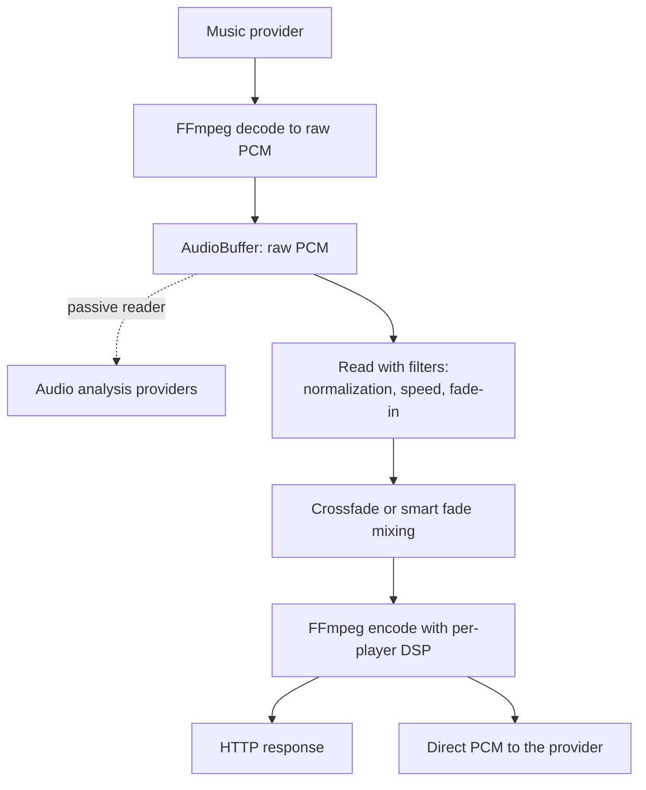

# Streams controller

Owns everything between a resolved media item and audio arriving at a player: decoding, buffering,
normalization, crossfading, DSP, encoding and HTTP delivery. It also hosts the passive audio
analysis readers that sit on the playback buffer.

## Module layout

| Module | Role |
|---|---|
| `controller.py` | The `StreamsController`: HTTP endpoints and the public streaming API |
| `audio.py` | `StreamsAudio`: stream acquisition, queue and flow streaming, format selection, output plans |
| `audio_buffer.py` | `AudioBuffer`: in-memory PCM buffering with seek support |
| `audio_processing.py` | `AudioProcessingManager`: the per-queue processing chain reported to clients |
| `audio_analysis.py` | `AudioAnalysisController`: distributes buffered PCM to the analysis providers |
| `live_announcements.py` | Announcement audio pushed into the server and served back out |
| `ogg_handler.py` | Chained OGG stitching for radio streams with in-band metadata |
| `smart_fades/` | Crossfade planning, rendering and mixing. See [smart fades execution](#smart-fades-execution) |
| `constants.py` | Buffer sizes, pacing profiles and config keys |
| `strings.json` | Translatable labels for this module's config entries |

Generic audio utilities that need no controller access live in
[helpers/audio.py](../../helpers/audio.py), and FFmpeg process management lives in
[helpers/ffmpeg.py](../../helpers/ffmpeg.py).

## A separate HTTP server

Streams are served by a dedicated HTTP-only server on its own port, independent of the main
webserver. This is deliberate on three counts. There is no TLS, because many embedded players
struggle with handshakes and the stream server only serves the local network. There is no
authentication, because players cannot hold credentials; instead a stream URL carries a session id
that is validated per request, which is what rejects a stale stream attempt. And the separate port
keeps audio delivery isolated from the API.

### Audio travelling inwards

Live announcements are the one path where audio travels into the stream server rather than out of
it. A client pushes raw PCM while a user speaks and it plays on a player as an ordinary
announcement. The two halves live on different servers because neither can do the job alone. The
inbound half is a WebSocket on the main webserver, because pushing audio is a privileged action
that needs authentication and TLS, and because browsers require a secure context to reach a
microphone at all. The outbound half is an ordinary stream server route serving the buffered speech
as a WAV, because the announcement renderer only ever pulls from a URL, which keeps live
announcements on the same path as every other announcement.

The announcement is dispatched only once the clip is complete. Players that announce natively need
the whole clip up front: AirPlay renders it to a file and schedules one synchronized instant across
every group member from its exact duration, and Sonos needs the duration to know how long the clip
runs. A still-growing clip gives one player type a head start and truncates another, so every player
gets the same finished clip.

## The audio buffer

The buffer is the single source of truth for audio data, and it stores raw decoded PCM with no
filters applied. Filters are applied on the way out, which is what lets several consumers read the
same buffered audio and apply different processing.

Every queue stream goes through a buffer, tracks and radio alike. Buffers are created and start
filling before the player requests the stream, so playback starts immediately. An existing valid
buffer is reused for seeks and reconnections. A forward seek within the buffered window waits for
the producer; a larger one re-fetches at the seek position.

Two modes. A seekable buffer keeps a deque of one-second chunks and discards the oldest once it
reaches its size limit. A rolling buffer is a short FIFO for non-seekable sources such as radio,
where the consumer pops chunks sequentially. A realtime source is considered ready after about a
second rather than waiting for the usual fill, and a seek on one always restarts at the source.

Producer errors are captured and surfaced when a consumer reads, so a consumer can drain what was
already buffered before the error appears at the end of the stream.

## The pipeline

Players that consume HTTP streams are served from the stream server's endpoints. Player providers
that consume raw PCM directly, such as AirPlay and Sendspin, take the stream in process.

### Output pacing, and why it stays

Audio handed to a player is rate-limited a little above playback speed, after an opening burst.
Music Assistant serves audio for listening, not for collecting. Barely above playback speed the
player's buffer still grows, while pulling an entire catalogue takes about as long as listening to
it would.

The profile follows what is being served rather than the player receiving it. A track handed over on
its own gets the largest burst, because the opening chunk is what a gapless player holds before it
starts and the head start rides out a hiccup later in the track. The flow stream and sources that
deliver just in time, meaning radio and a Spotify track on its Soloist backend, get a near-realtime
profile, because such a source delivers barely above playback pace and what it banks ahead is all
its end-of-track crossfade has. Live audio sources get the smallest burst, because whatever the
burst hands over sits in the player's buffer as listening delay.

This pacing is load-bearing and intentional. Do not remove it to make buffering look faster; the
constant carries the same warning. The live decode side is separate and stricter.

## Volume normalization

Normalization levels perceived loudness across tracks from different sources. The configured mode
is per queue, and the target loudness is a global setting on this controller. The fallback modes
resolve down to a concrete one depending on whether a stored loudness measurement exists, with
separate preferences for radio and for tracks.

Dynamic mode levels in real time. Measurement mode applies a static gain from the stored
measurement. Fixed gain applies a constant adjustment. The mode is resolved twice, once when stream
details are built and again after loudness hydration, because a measurement may land in between.

One mode is an outcome rather than a choice: when a provider reports that it already delivers
normalized audio, applying normalization on top would level already-levelled audio, so the chain
stays empty and the mode records why. Crossfade has the same counterpart for providers handing over
already-crossfaded audio, such as a DJ mix. Both add no filter, so neither defeats bit-perfect
detection the way an active stage would.

Measurement itself is produced by the builtin loudness analysis provider. Loudness supplied
externally, by file tags, ReplayGain or a provider's own figure, is written under a virtual provider
domain that wins the priority walk.

## Crossfade

Crossfade is queue-scoped: the toggle and the mode are per queue with a global default, while the
duration is global only, because a numeric range cannot carry the tri-state option. The effective
mode is resolved in one place. Smart crossfade is the default when it is available, and is only
honoured when available, so anything else lands on the standard crossfade.

Availability requires both a buffer preset with room for the analysis window and the smart fades
analysis provider to be loaded.

A transition is vetoed when either side is not a track, when there is no next item, when both
tracks belong to the same album unless the user opted in, and, outside flow mode, when the two
tracks have different sample rates and the player has not opted in. There is no reliable way to
detect a gapless album, so album-internal transitions are left alone by default. Pending crossfade
data is also discarded when the user seeks into a track or the next item changed while the crossfade
was being prepared.

### Smart fades execution

Analysis and execution are separate. The optional smart fades provider produces the signals; this
package consumes them. See
[providers/smart_fades](../../providers/smart_fades/README.md) for the planner, the filters and the
rendering model.

The mixer builds before it mixes. Building picks the implementation and primes its filters without
touching a byte of audio, walking a degradation chain that ends at the standard crossfade, which
never fails. The smart path needs beats on both tracks and falls back immediately without them.

The fallback deliberately keeps the outgoing track's analysis: the standard crossfade uses it to
work out how much of the tail to retain so an audible vocal is not clipped, instead of blindly
stripping trailing silence. The buffered tail is capped at half the track duration and abandoned
below a few seconds, where it would not be musically meaningful.

## DSP and output plans

Per-player DSP is applied in the final encoding stage. The output plan returns the executable filter
list wrapped alongside a client-facing description of the same processing. The chain runs input
gain, then the user's enabled filters, then output gain, then channel selection.

There is no unconditional limiter at the end. Clipping protection is a filter the user opts into
rather than a fixed cost on every stream. Only filters that actually emit parameters count as
active, so a neutral filter is not reported as a stage and does not defeat bit-perfect detection.

Most filters render to a plain FFmpeg audio filter string. Convolution is the exception, because the
impulse response is a second input, which is why the filter graph builder switches to a complex
filter as soon as one is present. The sound effect overlay uses the same path.

Some FFmpeg flag choices in the filter catalog carry non-obvious reasoning, so read the existing
comments before changing them. Pitch shifting preserves formants so voices do not sound like
chipmunks. The limiter runs without auto make-up so it stays a transparent ceiling. Stereo widening
disables the filter's internal hard clipping, which would otherwise clamp a widened signal before
the output gain could bring it back down. Crossfeed overrides a default that would attenuate every
stream.

**Grouping can suppress DSP.** A player in a multi-device group whose members do not support
per-device DSP has its DSP reported as disabled by the group rather than as off, because per-device
filters would produce different audio on each member and break synchronization. That distinction
matters to the UI: a config that is enabled but suppressed reads differently from one the user
turned off.

One output path can serve several players, so a plan resolves its shared destinations, mapping
protocol players onto their user-facing parent, and reports the plan for every one. Passing an empty
set rather than nothing marks a path that can gain destinations later, which is what lets a stored
template fan out to players that join mid-stream.

## What is happening to this audio

The processing manager answers that question for clients. It tracks processing per queue session and
publishes a complete chain onto each queue item's stream details.

The chain splits the way the work does. Queue processing is what happens once for the whole queue
stream: the internal PCM format, normalization, playback speed, crossfade mode and overlay. Outputs
are what happens per destination on the way out, and players whose effective output is identical
collapse into one entry listing several player ids.

State is keyed by queue and gated on the queue's session, so a superseded producer silently stops
publishing. Housekeeping drops state for items before the current index and reconciles the output
set against the players actually attached, which is how a player joining or leaving a group updates
the chain. Chains are republished only when they changed.

**Fidelity and bit-perfect.** Quality is classified from codec semantics, and an output's quality is
the minimum of the input and output quality, because fidelity cannot be gained downstream.
Bit-perfect answers whether the decoded source samples reach the player untouched. It is unknown
until the formats are resolved, and otherwise false unless the output is lossless, the sample rate,
bit depth and channel count are identical at every stage including any intermediate handoff format,
and there is no normalization, speed change, crossfade, overlay, effective DSP or channel mapping.
Stages that apply an intentionally invisible transform, such as a fade-in, mark the audio as
altered.

## Format selection

The final output format comes from the requested extension and the player's capabilities. The
content sample rate is used when the player supports it, otherwise its highest supported rate, and
bit depth is then capped by the depths actually paired with that rate rather than by the player's
global maximum, so a player that only does 24-bit at 48 kHz is described correctly. Lossy formats
cap lower. Non-track media such as radio and announcements is capped by the source's declared depth
rather than the internal PCM depth, which normalization or DSP widens.

The internal PCM format never upsamples: it picks the highest supported rate at or below the source
rate, falling back to the lowest supported rate when the source is below every one of them. Bit
depth follows the source unless crossfade, normalization, overlay or DSP is active, where a wider
format gives processing headroom. Crossfade and overlay force stereo, because mixing needs a
consistent channel count. Live audio sources short-circuit to a passthrough at the source's own rate
and depth where the player allows it.

Flow mode takes its rate from the player's own flow mode setting rather than a fixed ladder, and
because a flow stream can feed several players it intersects their supported rates and fails when
they share none.

## Audio analysis

Analysis is a passive observer of the playback buffer. Nothing is pushed to it and the audio path is
not modified. The reader keeps its own cursor over the buffer's retained chunks, so a slow analyzer
falls behind and loses its session rather than holding up playback.

A session starts only for a freshly created buffer at the start of a track, and never for live audio
sources or sound effects. Providers decline a session when the track already has analysis at the
provider's current version or exceeds the provider's duration ceiling, and a session with no
accepting provider is never started. The buffer's only hook is a cancel callback, used to drop the
session when the buffer is torn down. If the reader falls a full window behind and the chunk it needs
has been evicted, the session is dropped rather than allowed to slow the producer. A stream that
ends well short of its expected duration is discarded rather than finalized, so a source that died
mid-track cannot persist truncated analysis. At most two realtime sessions run per queue, the
playing track and its preloaded successor, and a provider that exceeds the per-chunk hang guard is
evicted.

| Provider | Produces |
|---|---|
| `loudness_analysis` | Integrated loudness, so later playback can use measurement-based normalization |
| `smart_fades` | Beats, downbeats, key, energy, spectral centroid and vocal activity |
| `sonic_analysis` | Descriptor scalars and embeddings, powering similarity and mood features |
| `acoustid_lookup` | A recording id and ISRC from a fingerprint, with no signal analysis of its own |

Results are persisted per item and provider, so a track is analyzed once and reused later.

The same provider interface backs the nightly background scan, which analyzes tracks that have no
current analysis yet. **The scan is restricted to filesystem providers on purpose.** Pulling audio
from a streaming provider to analyze it is not what the user's subscription is for, so keep that
restriction in place.

## Audio overlay

A per-queue overlay mixes a looping sound effect into the queue's audio. Mixing happens once per
queue stream, so every synced player consuming that stream hears the identical mix.

An active overlay forces flow mode, because the overlay has to play continuously across track
boundaries and that is impossible with per-item stream requests. Radio is the exception, since it is
already one long-lived stream and is wrapped per request instead. The internal format widens for
clipping-free headroom.

Failures degrade rather than interrupt. An overlay source that cannot be resolved means playback
continues without it, and an overlay input that dies mid-stream leaves FFmpeg passing the main audio
through. Audio already in a player's buffer is unaffected by an overlay change, which is why the
queue controller restarts playback on an audible change, and for the same reason a seek can shift
the overlay position.

## Configuration

Config entries cover the buffer size preset, which defaults by host memory, the normalization modes
and gains for radio and tracks separately, the global target loudness, whether consecutive album
tracks may crossfade, the bind address and port and the IP published to players in stream URLs, and
the concurrency of the nightly analysis scan.

## Related architecture docs

- [Playback](../../../docs/architecture/playback.md) for the end-to-end flow from a play request to audio.
- [Player model](../../../docs/architecture/player-model.md) for how a player declares its supported formats.
- [Grouping and volume](../../../docs/architecture/grouping-and-volume.md) for group streams and shared outputs.
- [Plugins](../../../docs/architecture/plugins.md) for live audio sources that bypass this pipeline.
