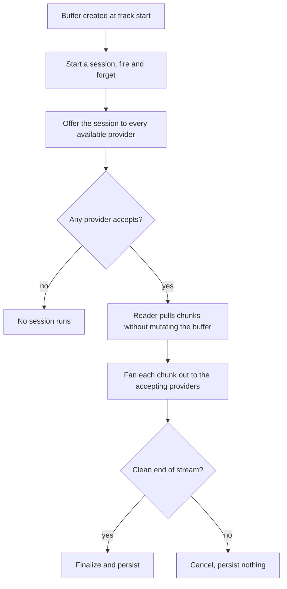

# Audio analysis

Part of the [streams controller](README.md).

Analysis is a passive observer of the playback buffer. Nothing is pushed to it and the audio path
is not modified. The reader keeps its own cursor over the buffer's retained chunks, so a slow
analyzer falls behind and loses its session rather than holding up playback.

## Session rules

A session starts only for a freshly created buffer at the start of a track, and never for live
audio sources or sound effects, which have no stable identity to attach results to.

Providers decline a session when the track already has analysis at that provider's current version,
or when it exceeds the provider's duration ceiling. A session with no accepting provider is never
started at all.

The buffer's only hook is a cancel callback, used to drop the session when the buffer is torn down
because the track was skipped or the buffer was cleaned up.

If the reader falls a full window behind and the chunk it needs has already been evicted, the
session is dropped rather than allowed to slow the producer. A stream that ends well short of its
expected duration is discarded rather than finalized, so a source that died mid-track cannot
persist truncated analysis.

At most two realtime sessions run per queue, the playing track and its preloaded successor. A
provider that exceeds the per-chunk hang guard is evicted from the session.

## Providers

| Provider | Produces | Used by |
|---|---|---|
| `loudness_analysis` | Integrated loudness | Measurement-based [normalization](processing.md) |
| `smart_fades` | Beats, downbeats, key, energy, spectral centroid, vocal activity | [Smart crossfades](../../providers/smart_fades/README.md) and queue ordering |
| `sonic_analysis` | Descriptor scalars and embeddings | Similarity and mood features |
| `acoustid_lookup` | A recording id and ISRC from a fingerprint | Library matching; produces no signal analysis |

Results are persisted per item and provider, so a track is analyzed once and reused on later
playback.

## The background scan

The same provider interface backs a nightly scan that analyzes tracks with no current analysis yet,
at a configurable concurrency.

**The scan is restricted to filesystem providers on purpose.** Pulling audio from a streaming
provider in order to analyze it is not what the user's subscription is for. Leave that restriction
in place.
