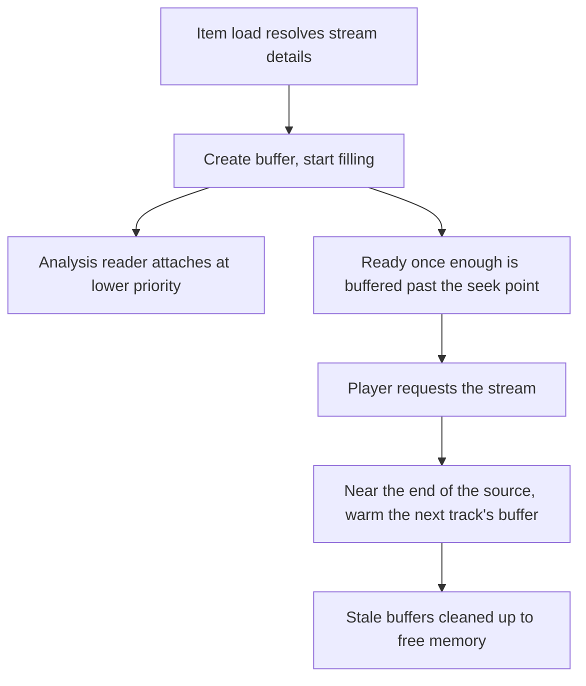

# Buffering and pacing

Part of the [streams controller](README.md).

## The audio buffer

The buffer is the single source of truth for audio data, and it stores raw decoded PCM with no
filters applied. Filters are applied on the way out, which is what lets several consumers read the
same buffered audio and apply different processing to it.

Every queue stream goes through a buffer, tracks and radio alike. Buffers are created and start
filling before the player requests the stream, so playback starts immediately rather than waiting
for a provider round-trip. An existing valid buffer is reused for seeks and reconnections.

Two modes:

| Mode | Used for | Behaviour |
|---|---|---|
| Seekable | Tracks and announcements | A deque of one-second chunks, oldest discarded once the size limit is reached |
| Rolling | Radio and other non-seekable sources | A short FIFO the consumer pops sequentially |

A forward seek inside the buffered window waits for the producer to reach it. A larger seek
re-fetches at the seek position instead, because waiting would take longer than starting again.

Realtime sources behave differently on both counts. They are considered ready after about a second
rather than waiting for the usual fill, and a seek on one always restarts at the source rather than
waiting for the buffer to catch up.

## Buffer lifecycle

Producer errors are captured rather than raised into the consumer immediately, so a consumer can
drain what was already buffered and only meets the error at the end of the stream.

Every buffer records the session that claimed it. See
[state and continuation](../player_queues/continuation.md) for how a stop decides which claimed
audio to keep.

## Output pacing, and why it stays

Audio handed to a player is rate-limited a little above playback speed, after an opening burst.
Music Assistant serves audio for listening, not for collecting. Barely above playback speed the
player's buffer still grows, while pulling an entire catalogue takes about as long as listening to
it would.

The profile follows what is being served rather than the player receiving it:

| Profile | Used for | Why |
|---|---|---|
| Default | A track handed over on its own | The opening chunk is what a gapless player holds before it starts, and the head start rides out a hiccup later in the track |
| Near realtime | The flow stream, radio, and providers that deliver just in time | Such a source delivers barely above playback pace, and what it banks ahead is all its end-of-track crossfade has |
| Low latency | Live audio sources | Whatever the burst hands over sits in the player's buffer as listening delay |

This pacing is load-bearing and intentional. Do not remove it to make buffering look faster; the
constant in the code carries the same warning. The live decode side is separate and stricter.
