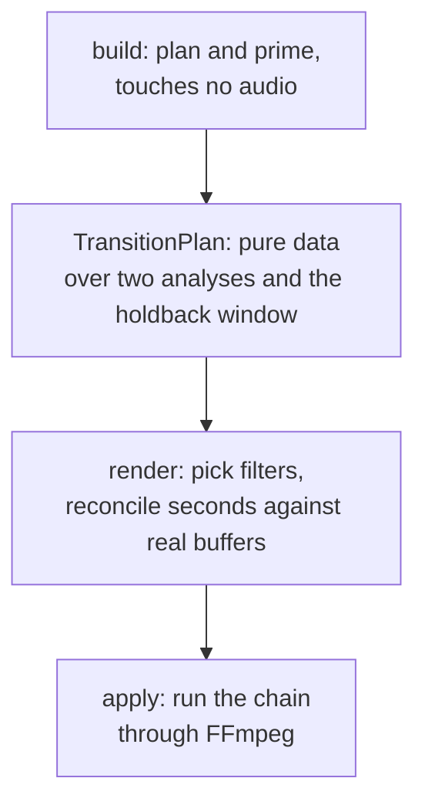
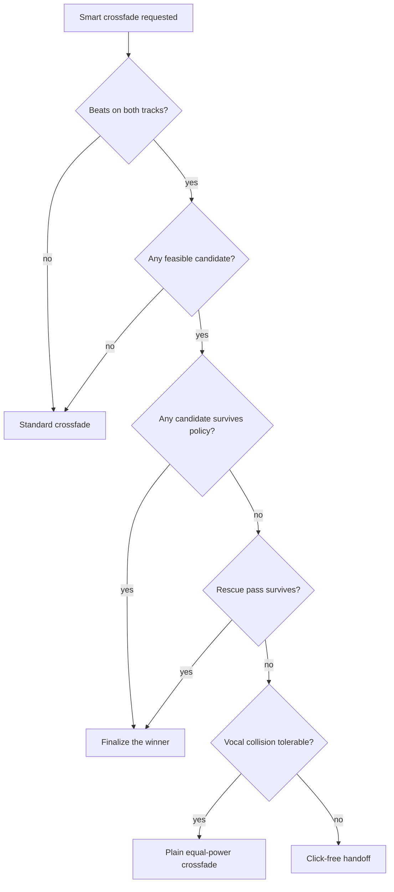

# Smart fades execution

Plans and performs a musical transition between two tracks. Part of the
[streams controller](../README.md); the analysis this consumes comes from the
[smart fades provider](../../../providers/smart_fades/README.md).

## Plan and render are separate

Deciding a transition and performing it are separate stages, and that split is the architecture.

Read it as a sentence: plan in seconds, render into filters, apply to bytes.

Planning reads an **immutable** context that every candidate build shares and none mutates. It
generates many candidates, scores them with independent policies, and ships the winner. Feasibility
is decided by candidate generation and policy rejection rather than by one confidence threshold.

The payoff is that a plan can be computed and reasoned about before a single audio byte is
buffered, and an alternative strategy drops in as a sibling planner.

Applying feeds FFmpeg from **two** inputs rather than one. The outgoing tail goes in through its
own pipe, so no temporary file ever touches disk, while the incoming head arrives on standard
input. Both are fed concurrently because either can exceed the kernel pipe buffer, and the incoming
side may still be an open stream rather than finished bytes.

## Nothing here may break playback

Every stage has a fallback, and the last one cannot fail.

The rescue pass and the plain fallback are two distinct rungs, and the ordering is a listening
judgement rather than a technical one. A plain volume crossfade reads far less abrupt than the
click-free handoff, so it ships whenever its own vocal collision is tolerable. Only when even that
collides badly does the handoff take over, which cannot fail and cannot sound good either.

"Not applicable" is the planner saying these two tracks cannot yield this transition, which is
distinct from an error: it is logged at debug level while a real build failure is logged as a
warning.

When the smart build falls back it **retains the outgoing track's analysis** and hands it over, so
the standard fade can compute how much tail to keep rather than blindly stripping trailing silence.

## Module layout

| Module | Role |
|---|---|
| `mixer.py` | Picks the implementation, primes it, and later executes it |
| `fades.py` | The fade interface plus the smart and standard implementations |
| `planner/` | Candidate generation, policies, selection and assembly |
| `renderer.py` | Turns a plan into a filter chain and a timing breakdown |
| `filters.py` | The composable PCM filters the renderer picks from |
| `bands.py` | Bar-level band power statistics over the transition window |
| `structure.py` | Bar-level structure detection: mastered fadeouts, valid outro zones |
| `vocal.py` | Vocal windows and the collision score between two tracks |
| `models.py` | The plan and its parts, next to the only code that uses them |
| `helpers.py` | Tempo steps, downbeat extrapolation, dB ramps |

### Inside the planner

The planner itself is deliberately thin and owns no logic; it orchestrates five collaborators.

**The context** holds every per-transition fact, frozen: each track's analysis and usable beat
grids, their band profiles, the outgoing tail's anchors and audible boundary, the chosen tier, the
vocal masks and the coda detections. It deliberately excludes anything depending on a candidate's
chosen overlap or re-anchor point, because those are the candidate factory's job. Building it once,
frozen, is what makes scoring trustworthy: two builds of the same candidate are identical.

**Candidates separate intent from timing.** A spec is a generator's declared intent, meaning which
tier rung, which anchor and entry point, and which relaxation was applied. A candidate is that spec
paired with its timed plan and metrics. The factory produces timed candidates only; EQ is
deliberately absent, because scoring never needs it, so the expensive EQ assembly runs once for the
winner rather than for every candidate.

**Policies judge one rule each** and return either an outright rejection or a soft penalty folded
into ranking. Selection runs **every** policy on **every** candidate with no short-circuit on the
first rejection, and picks the lowest-penalty survivor. Running them all is what makes the debug
log a complete scoreboard rather than whichever rule happened to fire first, and that is the
difference between being able to tune this and not.

**Assembly** computes the band handover EQ once for the winner, and owns the two last resorts.

## The plan

The plan is a renderer-agnostic description of a transition: every decision, no audio bytes and no
filters. All times are in the outgoing track's buffer-local seconds. It carries the tier, the
audible end of the fade-out tail, the overlap length, the band EQ, the tempo ramp, the head and
tail trims, and telemetry.

### Tiers

The tier is decided from tempo compatibility, key and blendability, and it drives overlap length,
tempo and EQ. A full blend needs both tempos within stretch range and compatible keys. Within
stretch range but with clashing keys gives a shorter energy-anchored blend. Incompatible tempos or
unblendable material gives a short downbeat-snapped fade.

### Band EQ

The EQ is a content-aware three-band handover: who owns the low end, and when it swaps. A shelf
that came out shallower than the bypass floor is dropped rather than rendered.

**Two coordinate systems coexist here, and mixing them up desynchronizes the EQ from the audio.**
Outgoing-side schedules are in input time, before stretching. Incoming-side schedules are in
post-trim time.

The assembler can scale the mid handover down or steepen the low ramps to reconcile the EQ with a
vocal-protected or tightened transition.

### Tempo

The tempo plan is a list of timestamped ratios in the outgoing track's buffer-local time; empty
means no stretching. Integrating it says how many seconds the stretch removes up to a given point,
going negative where the stretch slows the tail down.

That bookkeeping has one non-obvious case worth reading the docstring for: the stretcher
initializes at the first step's ratio from time zero, so the span before the first step already
runs stretched. That is a no-op for a multi-step ramp starting at unity, but not for a single-step
one.

### Vocal awareness

Vocal protection engages **per deck**. A track with a validated vocal timeline gets its vocals
protected, while one without is planned on energy facts alone, so a partially analyzed library
degrades per track rather than all-or-nothing.

Metrics record the outcome, each field defaulting to its energy-only value: which strategy shipped,
how much audible outgoing material was dropped, how much outgoing vocal falls inside the crossfade,
whether the anchor landed on a downbeat, and the raw and curve-weighted vocal collision. The trim
and downbeat facts are populated on every plan; the collision fields need both tracks to carry a
validated timeline.

These guard against an interaction worth knowing: trimming to the audible boundary against a quiet
outgoing tail can otherwise strand the listener in silence on an energy-drop transition.

## The renderer

The renderer is the DJ's hands. It picks filters that realize the plan and produces the timing
breakdown, and it is the only place bytes re-enter. The plan is sized in seconds, so the renderer
reconciles that against the actual buffer lengths and drives both the overlap and the timing
bookkeeping from that single reconciled value.

The timing breakdown splits the output into pre-crossfade, crossfade and post-crossfade durations
plus any fade-in trim. The streaming layer needs it to account for the mix correctly across the
request boundary the handover happens on, and lyrics sync reads it too.

The standard crossfade shares the same interface but needs none of the planner. It clamps the
overlap to fit the shorter input and quantizes it to a whole number of PCM frames.

**That frame quantization is load-bearing rather than cosmetic.** Buffers are sliced on frame
boundaries, so a fractional overlap leaves the rendered buffer a fraction of a sample short of the
requested duration, and FFmpeg then silently produces no output at all.

## Related architecture docs

- [Playback](../../../../docs/architecture/playback.md) for where crossfade sits in the pipeline.
- [Normalization, crossfade and overlay](../processing.md) for the mixing stage this feeds.
- [Look-ahead and keeping a queue going](../../player_queues/continuation.md) for the ordering
  that uses the same analysis.
- [providers/smart_fades](../../../providers/smart_fades/README.md) for where the analysis is
  produced.
