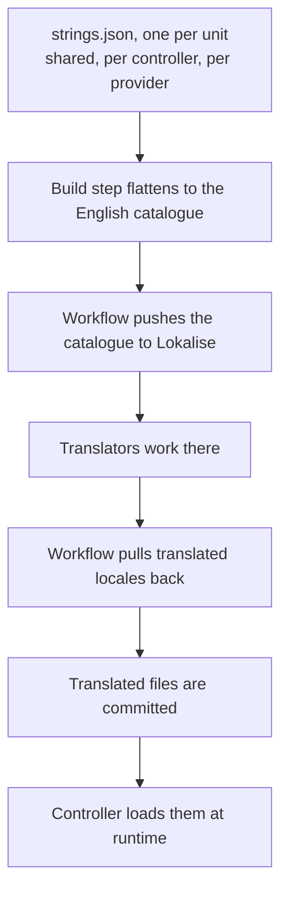

# Authoring translatable strings

Part of the [translations controller](README.md). This is the repository half of the pipeline; the
runtime half is in the README.

## Where a string goes

English source strings live in nested `strings.json` files, one per translatable unit.

| File | Namespace | For |
|---|---|---|
| The package-level `strings.json` | Shared | Strings used in more than one place, such as a common field label |
| `controllers/<name>/strings.json` | That core controller | Anything that controller owns |
| `providers/<domain>/strings.json` | That provider | Anything that provider owns |

Put a string in the shared file when it is genuinely shared. A label like "Username" is authored
once rather than once per provider.

## Adding one

1. Add the English text to the relevant `strings.json`.
2. Reference it from code by its relative key plus the owner, never by hardcoding the text. A
   pre-commit hook fails the build when a config entry hardcodes a label or description.
3. Run the build, or let the pre-commit hook run it, so the generated catalogue matches.
4. Commit both the authoring file and the regenerated catalogue.

Translated locales arrive later through the workflows; there is nothing to do for them by hand.

## The build step

The build flattens every authoring file into one sorted, fully-qualified map of key to English
text. It is standalone by design, with no imports from the package at all, so it runs without the
server's import chain and under any models version.

Two behaviours matter.

**Template providers are excluded.** Directories whose names begin with an underscore, meaning the
demo providers, and test directories are skipped, so their placeholder strings never reach
translators as noise.

**References are resolved and then dropped.** A string may be a reference token naming another key
instead of literal text, which declares "this key reuses a shared string". The builder validates
that the target exists as concrete text and then **omits the referencing key** from the generated
catalogue. Translators therefore translate the shared string exactly once, and the runtime finds it
through the owner-to-shared fallback described in the README.

A reference pointing at a missing target fails the build rather than silently producing an English
string in every locale.

The check mode compares the rendered output against the committed file and fails when they differ,
which is how the hook and CI keep the catalogue in sync with the authoring files. Rendering is
deterministic, so the check is stable.

## Translating and downloading

One workflow pushes the English catalogue to Lokalise, another pulls translated languages back as
flat maps with the same fully-qualified keys.

Translated files are committed, so a release ships its translations and the server never needs
network access to localize anything.
