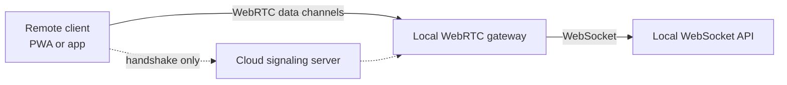

# Remote access

Part of the [webserver controller](README.md).

Remote access reaches an instance from anywhere without port forwarding or a VPN. A cloud
signaling server exchanges the WebRTC handshake, and a local gateway bridges data channel messages
to the local WebSocket API, so authentication and authorization work exactly as they do locally.
Traffic is encrypted end to end, and the signaling server only routes handshake messages; it
cannot inspect user data.

## The remote id

The remote id identifies an instance. It is derived from the fingerprint of the instance's
persisted WebRTC certificate rather than stored as a separate value, so it is stable for as long
as the certificate is.

It is also derived without loading the native WebRTC library, which is what lets the server report
it while remote access is switched off.

## Connection modes

Basic mode uses public STUN servers, needs no subscription, and works in most networks. It can
fail behind symmetric NAT or a firewall that blocks UDP.

Optimized mode uses Home Assistant Cloud STUN and TURN servers, which relay when a direct
connection is impossible. It requires an active cloud subscription, and the mode switches
automatically when that status changes.

## Data channels

One remote session multiplexes several data channels over one peer connection, routed by label.

A bridged channel is pumped both ways to a local WebSocket, which is how the Sendspin web player
and live announcements work. A channel served in the gateway itself handles proxied HTTP requests
for album art and other assets. Closing one of those tears down only that channel; the session
stays up.

The client's API channel has no fixed label. The first channel with an unrecognised label becomes
the API channel and is bridged to the WebSocket API. Any later unrecognised label is refused,
because taking it for a second API channel would replace the live bridge and break the session.
The API channel shares the session's lifetime, so closing it tears the session down.

### Framing a proxied reply

Proxied HTTP replies go back on the channel they arrived on. That is what keeps older clients
working without any version negotiation in the gateway.

The framing differs by channel. On the API channel the body is hex-encoded into one JSON message,
which costs several times the image's own size once chunking is applied on top. On the dedicated
proxy channel the reply is a JSON header followed by the body as raw binary messages, costing the
image's size and no more.

Those binary messages carry no request id, so the gateway holds the channel for a whole reply
rather than interleaving. Replies therefore go out one at a time, which a channel that sends one
message at a time would do anyway. A client that stops draining is given a bounded time per frame,
after which the reply is abandoned where it stands, so a reply can end short of its announced size
and the next header is what follows.

Bulk frames are sized to the channel's maximum message size, which is the lower of our own ceiling
and what the peer advertises in its handshake. One library assumes a small default when nothing is
advertised, so a client has to expect chunking well below the ceiling rather than at it.

### Adding a channel label is a compatibility event

A server from before the routing table existed mistakes an unknown label for the API channel,
which breaks the whole remote session rather than just the new feature.

A client must therefore feature-detect on the schema version reported in the server info before
opening a new channel. Adding a label means bumping that version and gating the client on the new
value.
