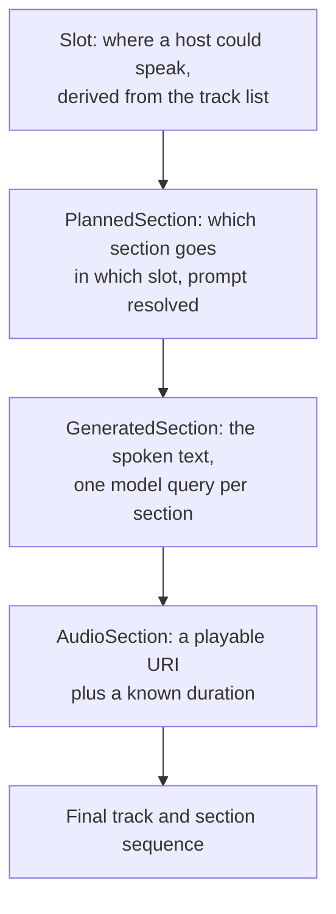

# Generating a program

Part of [AI Radio](README.md).

## Four representations

Each run walks a source track list through progressively more concrete forms.

Slots are built as one at the start of the playlist, one per track boundary, and one at the end,
each carrying its neighbouring track indices and a cumulative minute mark. Tracks whose duration is
unknown are assumed to be a few minutes. Those two coordinates, song index and elapsed minutes, are
what the placement guards measure against.

## The section rule DSL

A station's section order is a list of rules keyed by which slot they apply to. Each rule carries a
flow whose entries take one of three shapes.

| Entry | Behaviour |
|---|---|
| Must | The named section is always placed in this slot |
| Alternative | One section is chosen from weighted choices |
| Optional | Placed with a probability, subject to guards |

There is a no-op marker section, which is how an alternative expresses "or say nothing".

An optional entry supports three guards, evaluated against a running history of events per section:
a minimum gap in songs since that section last ran, a cap per rolling hour, and a requirement that
named placeholders resolved to something non-empty. That last one is why a weather segment silently
disappears when the forecast fetch produced nothing rather than reading out an empty slot.

The history is carried across batches in dynamic mode, so spacing survives the batching.

When several sections land in the same between-songs slot and the station names a merge section,
they are merged into a single prompt with the summed character budget and the strongest web-search
mode, so the host delivers one continuous segment instead of several disjoint ones.

## Prompts and placeholders

Prompts are templates. Substitution covers track and slot context plus runtime tokens prepared once
per run: the configured timezone's current date and time, and a live weather forecast for the
configured location.

**The forecast is only fetched when a prompt actually references it.** Skipping it otherwise keeps
a run from depending on an external service it does not use.

### What web search actually does

The web-search mode appends a sentence to the prompt asking the model to use current information.

This project has no web-search tool and does not verify that the backend has one. The mode is a
**hint passed through to whatever agent is fronting the request**, and the mode ranking exists only
so merging can pick the strongest hint.

## How speech enters the audio path

This is the part with the most engineering in it, because a speech URL is not natively a playable
queue item.

The rendered clip's URL is wrapped as a builtin sound effect URI. Sound effect is the right media
type: it is live provider content, deliberately not library-backed, and rejected by the favorites
and library-add paths.

Before returning, the duration cache is warmed deliberately. The URL is force-decoded to obtain a
real duration, and that plus a friendly title and artist are written into the builtin provider's
media info cache under the URL key.

**The reason is specific and worth preserving.** Probing a speech proxy URL returns no duration,
and the builtin provider classifies a duration-less URL as radio, which is an infinite stream, so
the queue would never auto-advance past the host segment. Pre-seeding a real duration makes it
parse as a sound effect and keeps the program flowing.

In dynamic mode, section entries are enqueued as rich sound effect objects rather than bare URIs,
so cover art and duration survive into the queue.
