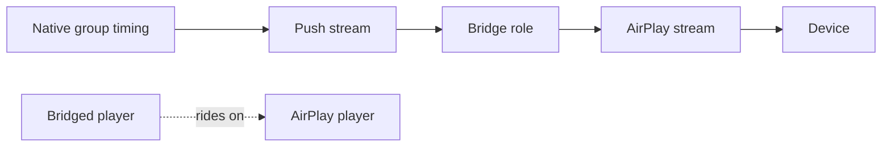

# The Sendspin bridge

Part of the [AirPlay provider](README.md). Exposing an AirPlay device as a client of the native
synchronized protocol, so it can be grouped with players that speak no AirPlay at all.

## What it is

When the native protocol's provider is enabled, each AirPlay player is registered as an external
client of it. The native side then owns timing and synchronization for the group, while AirPlay
remains the transport that actually carries the audio to the device.

The bridge is a **derived transport**, not a second route to the device. Before registering, it
declares the AirPlay player as the one the bridged player rides on, and the player controller
parents them from that declaration rather than from identifier matching. That makes the linking
deterministic instead of dependent on two endpoints looking alike. See
[protocol linking](../../../docs/architecture/protocol-linking.md).

The bridge requires the device to have a valid hardware address, since the client identity derives
from it.

## Losing the transport

The binary accepts and discards audio once its process is gone, so a lost transport is invisible
from the feeding side and only observable on the stream object itself. The bridge therefore checks
it on **every chunk**.

A dead stream is released, and a fresh one is cold-started and re-anchored on the group's live
timeline, so the speaker rejoins where everyone else is playing rather than where it left off.

### Giving up removes the speaker from the group

A start that raised, a protocol that never became ready, or a transport that dropped again shortly
after a recovery takes the speaker out of the session entirely.

That is not tidiness, it is the only way to tell the truth. The native side reports playback from
the group's own state, and the protocol gives a player no way to say it went silent. A bridge that
merely stopped feeding its speaker would hold the visible player on "playing" for the rest of the
stream. Leaving is what surfaces the silence: a shared group plays on without this speaker, and a
solo one stops.

### Coming back

Leaving a shared group schedules a bounded re-join on a series of increasing delays, through the
ordinary group-membership path, so a speaker that was briefly away returns on its own.

**A bridge that gives up again shortly after being put back is left out for good.** Re-joining
re-runs the very start that just failed, so without that rule a device unable to hold a connection
would cycle in and out of the group indefinitely.

The attempt is abandoned when the speaker has meanwhile been given a group or a stream of its own,
is streaming outside the bridge, or the group it left no longer exists. A speaker missing from
discovery is not re-joined but **is** looked for again on the next attempt, because a device that
rebooted stays absent for a while after it starts answering again.

A solo bridge has nothing to re-join, since leaving is what stopped it.

Note that the group re-join recovery in the streaming path covers native AirPlay grouping only: a
bridged player's group membership lives on its native-protocol player, not on the AirPlay one.

## Stalled receiver clocks

A receiver that never answers the clock probe renders silence.

The bridge warns and **anchors anyway**, which follows a native group start rather than a late
joiner. A late joiner is dropped because the session plays on without it; here dropping would stop
the speaker, and a stall is not evidence enough for that.

The binary reports a stall as a diagnosis rather than a verdict, since a receiver that begins
probing late goes on to report probing and then ready as usual. It re-arms that reporting on every
flush and start, while the server latches the last reading it parsed and drops the cold-state lines,
which carry no projection.

The re-armed report waits on the audio loop's next pass, which the flush acknowledgement ordinarily
beats, so a warm re-anchor is reading the cycle before it. Nothing is lost by that: a flush leaves
the receiver's clock alone, so the projection still describes the same acquisition, and the anchor
is right to sit past it whether or not that instant has already arrived. For a receiver that is not
answering at all, that reading is the only evidence there is.

This is **not** the give-up case above. The transport is healthy, so the bridge stays in its
session, and the stall reaches the user through the warning, which names the device and the clock
ports to check.

The binary diagnoses a stall deliberately more slowly than it projects readiness, so a cold start
reads as unreported and anchors without a projection; a stall is what a warm re-anchor sees. Either
way the receiver has not probed, so the post-commit clock verification described under
[late join](streaming.md#late-join) arms wherever the anchor clears the receiver's queue depth, and
holds the join's acknowledgement until it gives up short of the commanded anchor, bounded by that
anchor and well inside the acknowledgement timeout.

## Related

- [Streaming and synchronization](streaming.md) for anchoring, late join and the shared clock.
- [providers/sendspin](../sendspin/README.md) for the protocol on the other side of the bridge.
- [Grouping and volume](../../../docs/architecture/grouping-and-volume.md) for cross-protocol
  grouping.
