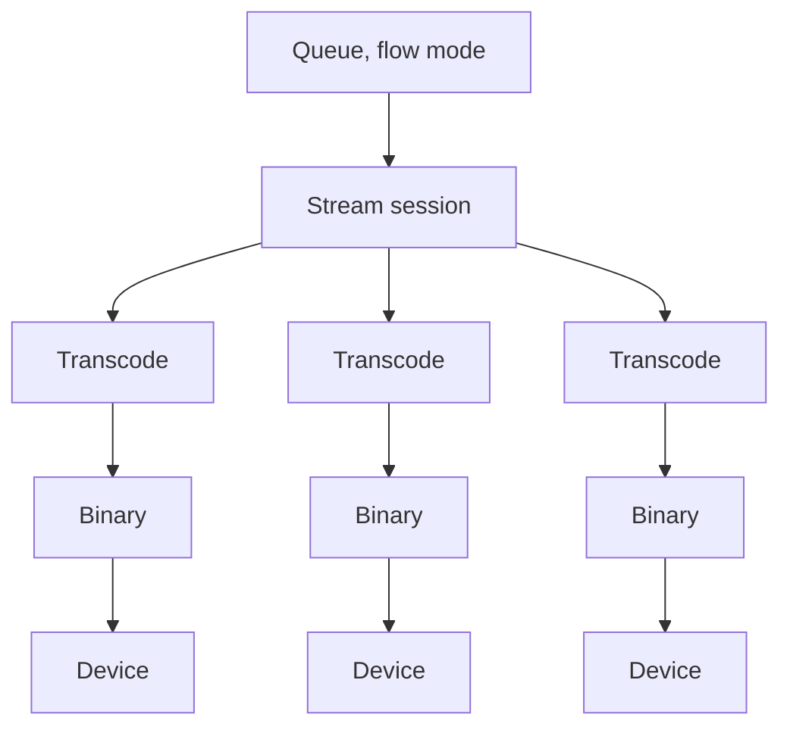

# Streaming and synchronization

Part of the [AirPlay provider](README.md). How audio gets from a queue to one or more devices
playing in sync.

## The shape of a session

One session covers a leader and every member synchronized to it. Each member has its own transcode
process and its own binary process; the session owns the audio distribution and the shared start
instant.

AirPlay always streams in flow mode, so the queue is one continuous stream and gapless playback and
crossfade come for free. Once started, the stream runs until it is stopped.

## Anchoring, not guessing

The provider never deals in protocol timestamp formats. Playback is anchored over the command
channel with a plain wall-clock instant meaning **the first pending input sample is audible exactly
then**, and that means the same thing on every route.

Starting a session runs in a fixed order, and every step is event-confirmed rather than timed.

1. Start every binary and wait until each reports connected.
2. Wire each member's transcode into its persistent input and begin feeding. The source's own first
   bytes are awaited first, on a generous budget, because a seek can land seconds ahead of what the
   source has produced. Only then does each member get a short budget to confirm its feed is
   flowing.
3. Send one shared start instant to every member, with a lead that depends on how warm the group
   is: shortest for a solo player, short for a warm group, and much longer for a cold one.

Because readiness is confirmed rather than assumed, a warm anchor only has to cover the receiver
re-anchor itself, and the binary bursts the receiver's pre-fill from the start instant rather than
needing time budgeted for it.

A per-player offset allows fine-tuning for a device that adds latency downstream, such as a TV or
an AV receiver.

## Warm boundaries reuse the connection

A seek, a track change or a grouped resume does **not** reconnect.

The session stops feeding old audio, kills the per-boundary transcode but **never** the persistent
input, flushes every member's live stream in place, waits for each flush to be acknowledged, feeds a
fresh transcode into the same input, waits for audio to be confirmed flowing again, and sends one
shared start. Standby keeps each connection alive for exactly this resume.

**Closing the input ends the stream for good**, so a flow that ends because it is being superseded
deliberately leaves it open for its replacement. The end-of-stream marker is sent anyway once the
queue stops loading that replacement, or at a timeout at the latest, so a failed transition still
lets the binary play out and the player report idle rather than hanging.

## Late join

Adding a player to an already-playing session has to place it on the group's existing timeline
rather than restarting anything.

The session keeps a few seconds of recent audio in a ring buffer. The joiner is then anchored
**past the point its binary projects the receiver's clock becomes usable**, and the binary
acknowledges the instant it can truly honour.

The order is anchor first, then prime. Before the start instant the binary only fills its own
bounded ring and sends nothing, so anchoring first lets it drain the primed audio as it arrives.
The content due at the acked instant is then either primed from the ring tail, when that instant is
at or behind the write head, or skipped off the head of the live feed when it is ahead. There is no
catch-up: the first post-start byte is made audible exactly at the acked instant and the anchor
freezes there.

**The projection can only push a joiner's anchor later, never earlier.** A minimum headroom is the
floor, and the value the anchor rests on whenever no projection arrives or the projection does not
clear it.

The binary also runs a post-commit clock verification that can pull an anchor forward, but it arms
only when the receiver has still not probed by the time the start is read, and only for an anchor
that clears the receiver's queue depth by a margin. The deeper defaults for device families that
need them reach past the point where a joiner's anchor no longer clears that, by design: the queue
starts releasing frames one depth *before* the anchor, and a line with audio already on the wire
cannot be moved.

## Announcements mix rather than interrupt

An announcement is overlaid on the stream the device is already rendering, with the music ducked
underneath, without a flush and without a re-anchor, so the group timeline is untouched.

Native announcement support is therefore offered **only while there is live playback to mix into**.
An idle player falls back to the generic handling in
[players](../../../docs/architecture/players.md).

The clip is wrapped in ducked silence, because the binary holds the duck for the whole file:

| Part | Purpose |
|---|---|
| Lead-in | Music already ducked, nothing said yet. The announcement volume is raised here |
| Clip | The announcement itself, at announcement volume |
| Tail | Music still ducked. The volume is put back here |

Both volume changes are timed on the audible instant the binary acknowledges, and travel through the
players controller so they land on whichever control owns the output. Neither is ever heard as the
music changing level, because the duck is deepened by exactly the size of the volume bump: the music
keeps its perceived level while the clip gets louder. See [control.md](control.md) for who owns the
volume.

## The shared clock daemon

Receivers that advertise it are timed with the precision clock protocol rather than a network time
source, and that imposes two constraints: only one process per host can bind the privileged clock
ports, and every receiver in a sync group must lock to the same grandmaster.

So the provider runs **one** clock daemon for its whole lifetime, spawned at setup, terminated at
unload, and restarted once if it crashes. Streams attach to its elected clock through shared memory
once it reports it is serving. A sync group resolves that choice once and applies it to every
member, so a group never mixes members on the shared clock with members off it.

Bridged players hold the same line across their bridged group. Their processes are spawned
independently and can outlive several tracks, so a bridge **adopts the choice a live group member is
already running with** and only asks the daemon when no such member exists. That is what keeps
members which start minutes apart, or which keep a warm process across a track change, on one clock.

### When it cannot bind

The official container runs with enough privilege to bind those ports. A custom container running
as a non-root user has to grant the binary the network-bind capability and retain it in the
container's bounding set, and the ports must be free in the container's network namespace.

If the daemon cannot bind, the provider logs a warning and streams fall back to network time.
Playback keeps working; multi-room synchronization on the modern route may be degraded.

## Related

- [binaries.md](binaries.md) for the status messages every step here waits on.
- [sendspin-bridge.md](sendspin-bridge.md) for bridged players and stalled receiver clocks.
- [Playback](../../../docs/architecture/playback.md) for flow mode and the pipeline upstream.
