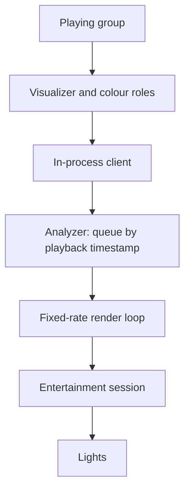

# Hue lights sync

Drives Philips Hue lights from the music. Each entertainment area on a paired bridge appears as a
light player, and reacts in real time once joined to a playing group.

## Where the work happens

Only the glue lives here. The bridge's own API, the encrypted streaming protocol and the session
handling are a standalone library, pinned in the manifest, which this provider drives through a
session facade that opens the stream on demand, runs the blocking handshake off the event loop, and
enforces the bridge's one-active-stream limit.

What is local is the client wiring and the analyzer that turns audio features into light frames.

| Module | Role |
|---|---|
| `provider.py` | Discovery, area enumeration and lifecycle |
| `bridge.py` | The in-process visualizer client and its subscription to the group's roles |
| `analyzer.py` | Beat rendering, colour cycling and the effect modes |
| `setup_flow.py` | Pairing with the bridge, which needs its physical button pressed |
| `constants.py` | Config keys and the spectrum request shape |

## Features arrive before the sound does

The provider registers with the local protocol server as an **in-process external visualizer
client**, with no socket involved, and its roles subscribe directly to the playing group's
visualizer and colour roles to receive spectrum, onset peaks, a beat schedule and a colour palette.

The subtlety that shapes the whole design: in-process delivery follows the **audio push**, and audio
is buffered seconds ahead of the playhead. Features therefore arrive well before the sound they
describe.

So the analyzer queues everything by playback timestamp rather than acting on arrival, and a
fixed-rate render loop samples it at the current server clock plus a configurable lead, sending one
frame per tick. The lead exists because the lights themselves are not instantaneous.

Areas are enumerated when the plugin loads, and each gets its own client and session.

## Effect modes

| Mode | Does |
|---|---|
| Smooth | Spectrum-driven brightness with a slowly drifting palette. The default |
| Ambient | Colour cycling only, no brightness modulation |
| Flashing | A brightness pulse on every beat, stronger on downbeats |
| Energetic | Large brightness swings on hits, plus fast palette rotation |

Beyond the mode, the configurable settings are the bridge address, which discovery normally fills
in, an overall brightness, and the lead time described above.

## Setup

Create an entertainment area in the Hue app first, since the provider enumerates areas rather than
creating them. Then add the provider, let discovery find the bridge or enter its address, press the
physical button on the bridge and pair. The areas appear as light players; joining one to a playing
group starts it reacting.

## Limitations

**Beats depend on analysis that may not exist yet.** The schedule is derived from the audio analysis
described in [controllers/streams/analysis.md](../../controllers/streams/analysis.md). A track
nobody has analyzed has no schedule, and the analyzer falls back to onset peaks until one arrives,
which is less precise and noticeably so on acoustic or vocal material.

**Areas are enumerated at load**, so adding one in the Hue app requires reloading the plugin.

**The bridge allows one active entertainment area at a time**, which is its limit rather than this
provider's.

Tested on the current bridge generations. Obvious directions from here are metadata-aware effects,
more modes, per-light effects using the spatial data an area already carries, and palettes extracted
from cover art.

## Related architecture docs

- [Plugins](../../../docs/architecture/plugins.md) for the plugin provider model.
- [Discovery](../../../docs/architecture/discovery.md) for how the bridge is found.
- [Playback](../../../docs/architecture/playback.md) for the buffering that puts features ahead of
  the playhead.
