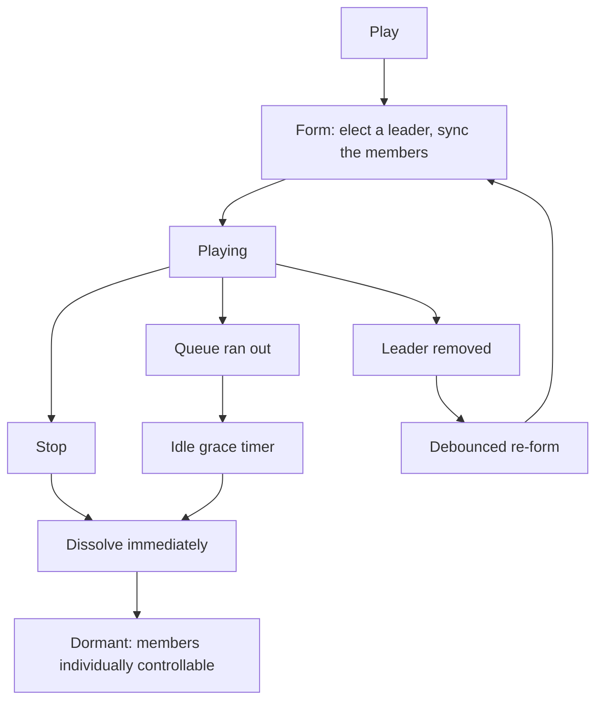

# Group lifecycle

Part of the [sync group provider](README.md). When a group holds its members, and when it lets them
go.

## The session drives it, not power

Playback forms the group. Stopping dissolves it at once, releasing the members back to individual
control.

**A natural transition to idle starts a grace timer instead of dissolving.** The queue simply
running out is not the same as the user stopping, and tearing down a live sync session on an
end-of-track gap, or on a quick "play something else", would cost an audible re-form for nothing.

**Removing the leader from a playing group schedules a debounced re-form**, so a cascade of unjoins
coalesces into one restart rather than one per member.

While dormant the group does **not** capture its members. They stay individually controllable, and a
command aimed at a member is not redirected to the group.

## The session signal

Whether the group is holding its members is **not** the power attribute. A separate active-session
signal is the canonical answer, and it is true while a leader is set, while the idle grace timer is
pending, and while a debounced re-form is pending.

The player model's active-group derivation consults that signal to decide whether the configured
members should report this group as the group that currently owns them. Reading power instead would
be wrong in every one of the three pending cases.

## Optional power

A power capability is deliberately **not** advertised by default. The session lifecycle already
forms and dissolves the group on its own, so a power toggle would be a second, conflicting way to
do the same thing.

A user who wants an explicit on and off can assign simulated power to the group, and then:

- Powering on re-applies the configured preset members and pre-forms the group, capturing its
  members immediately rather than waiting for playback.
- Powering off stops playback and dissolves the group.
- While powered on, stopping and the idle grace timer **leave the group formed**. It stays pinned as
  active until the user powers it off, which is the whole point of having asked for the toggle.

## Forming

Forming cancels any pending idle-grace or re-form timer, elects a leader if there is none, and moves
it to the front of the member list.

Two waits then happen before members are synced, and both exist because of real states a leader can
be caught in. If the leader still reports being synced to something else, forming waits for that to
settle and aborts if it stays stuck. If the leader is currently playing something of its own, it is
stopped and forming waits for it to go idle.

Only then are the remaining members synced to it. Forming is idempotent, so starting playback on an
already-formed group is a no-op rather than a re-form.

Starting playback sets the current media and active source optimistically before the leader confirms
them, so the UI responds immediately rather than after a protocol round trip.

## Dissolving

Dissolving removes all sync children from the leader and waits for the state to settle, then
schedules a clear of the leader's active output protocol, **deferred until it reports idle**, and
clears the leader.

The deferral matters: clearing the protocol while audio is still draining would pull the output out
from under the sound that is still playing.

Dissolving is skipped entirely while the group is pinned by simulated power.

## Related

- [membership.md](membership.md) for what happens when members come and go mid-session.
- [Grouping and volume](../../../docs/architecture/grouping-and-volume.md) for the session model
  shared with universal groups.
